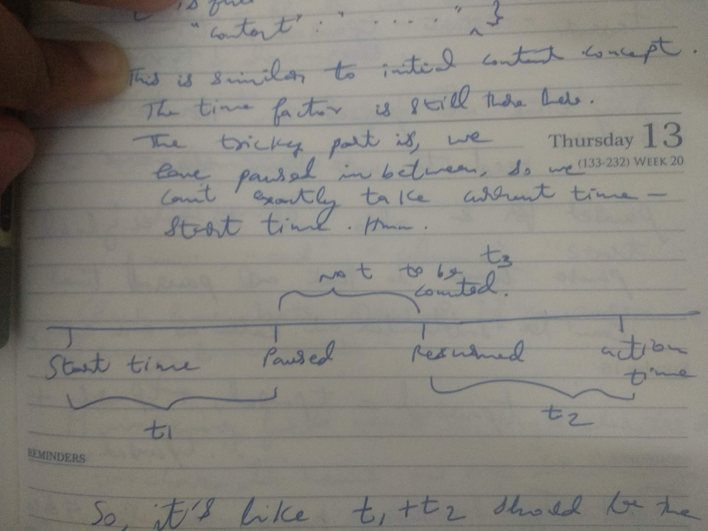
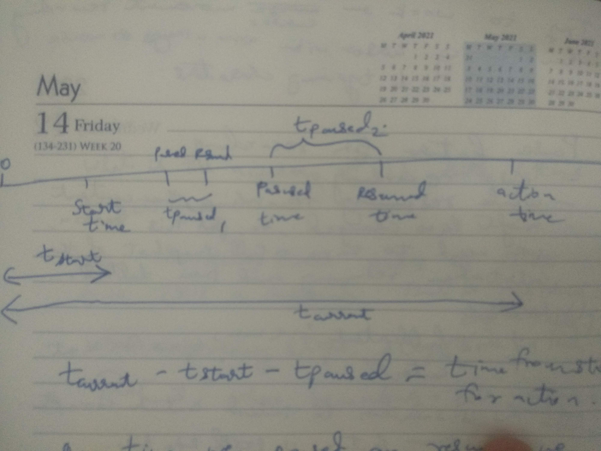

# Story

I missed to write a story while starting this project. It has been dormant till
now. I'm picking it up again now.

I realized I could capture the details in some form of text like a history of
stuff. What I was trying to solve and stuff.

I see I have been using Ace from https://cdnjs.cloudflare.com/ URL. It's closely
working with CDN.JS https://cdnjs.com/

The ace library is present here

https://cdnjs.com/libraries/ace/

Latest version as of now is 1.4.12

CDN.JS seems to have a lot of libraries.

https://cdnjs.com/libraries

---

Back to Ace.

https://ace.c9.io/

I seem to have read some stuff and written some code. I forgot most of it now.
😅 I need to read it again. Anyways. Let's see how readable the code is.

https://ace.c9.io/#nav=embedding

There are other CDNs it seems.

https://pagecdn.com/lib/ace

http://www.jsdelivr.com/#!ace or https://www.jsdelivr.com/package/npm/ace

Packaged version - https://github.com/ajaxorg/ace-builds/

I guess I could read this how to guide to start off

https://ace.c9.io/#nav=howto

Or just use the API reference, which is what I did initially I think

https://ace.c9.io/#nav=api

---

I think the goal of the project when I initially started out was to have a
collaborative text editor. I chose ace, but of course there are other editors
also. Ideally I should be able to plug and play collaborative text editing
feature to any editor after cracking the nitty gritties in each and some general
algorithm too :)

---

Some research on online / web based code editors

https://microsoft.github.io/monaco-editor/index.html

Monaco mentions it can't support mobile browsers hmm.

https://github.com/Microsoft/monaco-editor

---

https://github.com/icecoder/ICEcoder

https://icecoder.net/

---

https://codemirror.net/

https://ace.c9.io/

---

Write code to record what is typed by the user and replay it! :) Record in such a way that it can be replayed.

---

https://stackoverflow.com/q/47347986/4772008

https://bigl.es/tuesday-tooling-record-replay-keystrokes-with-python/amp/

https://www.tecmint.com/record-and-replay-linux-terminal-session-commands-using-script/amp/

---

The goal as of now is to use a code editor on the web, understand some basics of
it of course and use it to create something where when one user types something,
the changes are recorded, along with time. Then the recording can be replayed.
This is just a basic idea I had. This is to enable an experience where one user
can type and another user can see what the other user typed. But it won't or
might not be exactly real time experience. It will be more like near real time
experience based on an assumption of how video live broadcasting happens, but
that's something to check out! :) How online video live broadcasting and radio
live broadcasting and TV live broadcasting happens, to get some ideas and
inspiration.

Also, this kind of record and replay is not something new. Many people have done
it. I have in fact seen editor extensions do it. Online coding platforms do it,
which help people interview students on the platforms for coding rounds and the
recording of the student typing code is recorded and replayed, but not exactly
like a video, though that's also possible, in some sort of screen recording like
sense. But screen recordings will need a lot of data and would be high end. Just
recording the text that the student types is enough to play it back again.
Recording also means recording with time! That's the basic thing in recording.
The time factor. At least that's what I'm assuming. So, if the user types fast,
the replay should show that speed, and the same for typing slow or not typing at
all for sometime.

I want to try recording what a user types in ace editor. That's the goal.

As of now, the code looks like this

```html
<!DOCTYPE html>
<html lang="en">
  <head>
    <title>ACE in Action</title>
    <style type="text/css" media="screen">
      #editor {
        position: absolute;
        top: 0;
        right: 0;
        bottom: 0;
        left: 0;
      }
    </style>
  </head>

  <body>
    <div id="editor">
      function foo(items) { var x = "Wow, this is so cool!!!"; return x; }
    </div>

    <script
      src="https://cdnjs.cloudflare.com/ajax/libs/ace/1.4.11/ace.js"
      type="text/javascript"
      charset="utf-8"
    ></script>
    <script>
      var editor = ace.edit("editor");
      editor.setTheme("ace/theme/monokai");
      editor.session.setMode("ace/mode/javascript");
      editor.session.on("change", function (delta) {
        console.log(delta.start, delta.end, delta.lines, delta.action);
      });
      // editor.session.selection.on('changeSelection', function (e) {
      //     console.log(e);
      // });
      // editor.session.selection.on('changeCursor', function (e) {
      //     console.log(e);
      // });
    </script>
  </body>
</html>
```

Let's see if I can understand the code.

I forgot CSS now. 🙈 But I can see there's some CSS to help with positioning the
editor element.

Editor content is put in a `div` tag.

The `script` tag loads the ace editor library, and then we have our js code
running in another `script` tag.

I'm just checking out about Ace API here

https://ace.c9.io/#nav=api

It has a nice diagram as of now.

Apparently the editor is the main entry point to the API. It holds the
VirtualRenderer and EditSession it seems. And handles the mouse and keyboard
events - user events. I'm wondering what mouse events are there. Hmm.

Edit Session: Stores state related to a document it seems. I wonder what is this
state. I do see that it keeps track of some stuff. Maybe that's the state. Makes
sense. So, it keeps track of - Selection, Cursor Position, Scroll Position,
UndoManager, Language Mode (TextMode)

Document wraps the text document it seems. It's an array of strings it seems.
Hmm. What does that mean? Like, is it like each line in the document is a string
and all lines put together are stored as array of strings? I don't know.

TextMode defines Language Specific functionality it seems. Syntax highlighting,
which is very important and also Auto indentation rules. Pretty tricky stuff is
what I usually feel when I think how it's gonna be hard to manage all this when
it's a collaborative text editor. Or maybe it's not. I mean, many have solved
it. I'm sure there must be some way to tackle it all! :)

Virtual Renderer draws everything it seems. And it has layers? Controls? I see
some stuff under Controls - Text, Cursor, Selection. Not sure what this all
means, hmm

https://ace.c9.io/#nav=api&api=ace

We used the `edit` method to embed the Ace editor into the DOM's `div` element.

We then set themes using `setTheme` method in Editor

https://ace.c9.io/#nav=api&api=editor

I'm wondering how we know what is the string to pass to set the theme, hmm

https://ace.c9.io/#nav=howto mentions about themes

https://github.com/ajaxorg/ace/tree/master/lib/ace/theme has a lot of themes.

https://github.com/ajaxorg/ace#embedding-ace has some info on themes.

I was just wondering how I came up with that path though, and that if nothing
else is needed to get the theme, like an extra resource (css, js etc)

And wow, I can also make the editor read only! With

```javascript
editor.setReadOnly(true);
```

This way, the other user cannot edit the content on the editor and can simply
see what the remote user is typing on the code editor. At least this is the
first version I plan for! :)

I can also emulate user input it seems! :)

```javascript
editor.insert("Something cool");
```

Apparently the themes are loaded on demand. It is mentioned in the how-to guide.
I really need to read all the text in the documentation. I always glance or skim
through it 🙈

> Themes are loaded on demand; all you have to do is pass the string name:

I think it is downloaded from the Internet. Let me check the Network tab to
understand that! :)

Right, so, checking my browser, I found out that I'm only using one URL in my
code to get Ace editor library

https://cdnjs.cloudflare.com/ajax/libs/ace/1.4.11/ace.js

But the browser also makes calls to these URLs

https://cdnjs.cloudflare.com/ajax/libs/ace/1.4.11/theme-monokai.js

https://cdnjs.cloudflare.com/ajax/libs/ace/1.4.11/mode-javascript.js

https://cdnjs.cloudflare.com/ajax/libs/ace/1.4.11/worker-javascript.js

Not sure what the worker does. But the mode javascript is clear - it is for the
text mode / the language mode - to highlight javascript code! :) Same for theme
monokai - for the editor theme! Makes complete sense! :)

There's some demo on autoresize

https://ace.c9.io/demo/autoresize.html

I'm yet to understand it. But it looks nice, the demo :P :)

I also see some demos in `demo` directory in ace-builds repo
https://github.com/ajaxorg/ace-builds

I'm also on GitHub checking out some other ecosystem tools and plugins or what
not, for Ace

https://github.com/search?q=ace+editor

https://github.com/search?q=ace+editor+plugin

---

Now, back to my code.

```javascript
editor.setTheme("ace/theme/monokai");
editor.session.setMode("ace/mode/javascript");
```

These are straight forward. Setting theme and mode

I have some more code

```javascript
editor.session.on("change", function (delta) {
  console.log(delta.start, delta.end, delta.lines, delta.action);
});
// editor.session.selection.on('changeSelection', function (e) {
//     console.log(e);
// });
// editor.session.selection.on('changeCursor', function (e) {
//     console.log(e);
// });
```

Nice. So, I already have code to check about changes in the document. I can
already see logs in my browser console when I make changes. Hmm.

https://ace.c9.io/#nav=api&api=edit_session

I gotta check what else shows up in the delta / event data.

```javascript
{
  "start": {
    "row": 199,
    "column": 0
  },
  "end": {
    "row": 200,
    "column": 0
  },
  "action": "insert",
  "lines": [
    "",
    ""
  ],
  "id": 15
}
```

Sometimes I see the `id`, sometimes I don't. Gotta check why. But it's
interesting to see so much data. The above data is for attaching a new line.

One event data for deletion is

```javascript
{
  "start": {
    "row": 0,
    "column": 0
  },
  "end": {
    "row": 216,
    "column": 4
  },
  "action": "remove",
  "lines": [
    "",
    "function foo(items) { var x = \"Wow, this is so cool!!!\"; return x; }",
    "",
    "",
    "",
    "",
    "",
    "",
    "",
    "",
    "",
    "",
    "",
    "",
    "",
    "",
    "",
    "",
    "",
    "",
    "",
    "",
    "",
    "",
    "",
    "",
    "",
    "",
    "",
    "",
    "",
    "",
    "",
    "",
    "",
    "",
    "",
    "",
    "",
    "",
    "",
    "",
    "",
    "",
    "",
    "",
    "",
    "",
    "",
    "",
    "",
    "",
    "",
    "",
    "",
    "",
    "",
    "",
    "",
    "",
    "",
    "",
    "",
    "",
    "",
    "",
    "",
    "",
    "",
    "",
    "",
    "",
    "",
    "",
    "",
    "",
    "",
    "",
    "",
    "",
    "",
    "",
    "",
    "",
    "",
    "",
    "",
    "",
    "",
    "",
    "",
    "",
    "",
    "",
    "",
    "",
    "",
    "",
    "",
    "",
    "",
    "",
    "",
    "",
    "",
    "",
    "",
    "",
    "",
    "",
    "",
    "",
    "",
    "",
    "",
    "",
    "",
    "",
    "",
    "",
    "",
    "",
    "",
    "",
    "",
    "",
    "",
    "",
    "",
    "",
    "",
    "",
    "",
    "",
    "",
    "",
    "",
    "",
    "",
    "",
    "",
    "",
    "",
    "",
    "",
    "",
    "",
    "",
    "",
    "",
    "",
    "",
    "",
    "",
    "",
    "",
    "",
    "",
    "",
    "",
    "",
    "",
    "",
    "",
    "",
    "",
    "",
    "",
    "",
    "",
    "",
    "",
    "",
    "",
    "",
    "",
    "",
    "",
    "",
    "",
    "",
    "",
    "",
    "",
    "",
    "",
    "",
    "",
    "",
    "",
    "",
    "",
    "",
    "",
    "",
    "",
    "",
    "",
    "",
    "",
    "",
    "",
    "",
    "",
    "",
    "",
    "",
    "",
    "",
    "",
    "",
    "",
    "",
    "",
    "",
    "",
    "    "
  ],
  "id": 16
}
```

I guess a message like this

```javascript
{
  "start": {
    "row": 0,
    "column": 18
  },
  "end": {
    "row": 1,
    "column": 0
  },
  "action": "insert",
  "lines": [
    "",
    ""
  ],
  "id": 22
}
```

means that we need to start inserting information / data at row 0, column 18,
and what's the data to insert? how many lines of data? In this case, we have two
lines of data to insert. First line, the row 0, column 18, after that, we don't
need to put any data, as it's an empty string. Then, we go to next line, we
need to put empty string data again, which is nothing and then stop at row 1,
column 0, which is exactly the next line only.

When I copy and paste something, it looks like this

```javascript
{
  "start": {
    "row": 2,
    "column": 0
  },
  "end": {
    "row": 3,
    "column": 0
  },
  "action": "insert",
  "lines": [
    "let something = ok",
    ""
  ],
  "id": 25
}
```

Again, it was a line and a new line.

When typing stuff like a double quote, the system automatically adds another
closing double quote. Ace also shows the change information like this

```javascript
{
  "start": {
    "row": 0,
    "column": 10
  },
  "end": {
    "row": 0,
    "column": 12
  },
  "action": "insert",
  "lines": [
    "\"\""
  ],
  "id": 37
}
```

Same for parenthesis

```javascript
{
  "start": {
    "row": 2,
    "column": 9
  },
  "end": {
    "row": 2,
    "column": 11
  },
  "action": "insert",
  "lines": [
    "()"
  ],
  "id": 41
}
```

But ace doesn't put a closing curly brace for some reason. Hmm. Anyways.

For square bracket completion

```javascript
{
  "start": {
    "row": 2,
    "column": 0
  },
  "end": {
    "row": 2,
    "column": 2
  },
  "action": "insert",
  "lines": [
    "[]"
  ],
  "id": 45
}
```

Oh, for curly brace, ace puts the closing brace when pressing enter after first
curly brace

```javascript
{
  "start": {
    "row": 2,
    "column": 16
  },
  "end": {
    "row": 4,
    "column": 1
  },
  "action": "insert",
  "lines": [
    "",
    "    ",
    "}"
  ],
  "id": 71
}
```

I just noticed there's a `changeFold` event! :O So I can know when a code is
folded or even removed apparently

```javascript
EditSession.on("changeFold", function())
// Emitted when a code fold is added or removed.
```

The code looks like this

```javascript
editor.session.on("changeFold", function (delta) {
  console.log(delta);
});
```

And the console log message with delta looks like this on folding

```json
{
  "action": "add",
  "data": {
    "collapseChildren": null,
    "end": {
      "column": 6,
      "row": 4
    },
    "foldLine": {
      "end": {
        "row": 4,
        "column": 6
      },
      "foldData": [{}],
      "folds": [],
      "range": {
        "start": {},
        "end": {}
      },
      "start": {
        "row": 1,
        "column": 27
      }
    },
    "placeholder": "...",
    "range": {
      "end": {
        "row": 4,
        "column": 6
      },
      "start": {
        "row": 1,
        "column": 27
      }
    },
    "ranges": [],
    "sameRow": false,
    "start": {
      "column": 27,
      "row": 1
    },
    "subFolds": []
  }
}
```

It has a lot of data about how to fold the code. Nice! Also, the fold data,
fold lines etc, apparently it's some cyclic structure. I couldn't copy the
object from the browser console. Damn thing.

Similar to adding a fold, there's also a thing for removing the fold, where
`action` is `remove` with similar data.

Next thing I'm going to check is about selection. I wanted to see if users can
select information and if that can be captured.

https://ace.c9.io/#nav=api&api=selection

The code I wrote is commented out currently. I'm going to uncomment it

```javascript
// editor.session.selection.on('changeSelection', function (e) {
//     console.log(e);
// });
// editor.session.selection.on('changeCursor', function (e) {
//     console.log(e);
// });
```

Since I'm getting a lot of logs for all the different events, like change,
and for cursor, I'm going to comment out others and just have cursor and
selection event code

Even with cursor and selection, there's a lot of logs. Right.

I'm choosing selection first.

Right, so I'm just getting an event object with two functions / methods and no
other data. Hmm. Weird.

```javascript
editor.session.selection.on("changeSelection", function (e) {
  console.log(e);
});
```

```javascript
{
  "preventDefault": function s(){},​
  "stopPropagation": function i(){},
  "type": "changeSelection"
}
```

I was just wondering what to do now. Hmm.

Looking at how-to

https://ace.c9.io/#nav=howto

```javascript
editor.getSelectedText(); // or for a specific range
editor.session.getTextRange(editor.getSelectionRange());

editor.selection.getCursor();

editor.gotoLine(lineNumber);

editor.session.getLength();
```

at Editor level

https://ace.c9.io/#nav=api&api=editor

```
getSelection() -> Selection

Returns selection object.

---

getSelectionRange() -> Range

Returns the Range for the selected text.

---

getSelectionStyle() -> String

Returns the current selection style.
```

But the documentation doesn't have `editor.getSelectedText();` though. Hmm.
In the list methods that is.

https://ace.c9.io/#nav=api&api=edit_session

```
getTextRange(Range range) -> String

Given a range within the document, this function returns all the text within that range as a single string.

Arguments
range:	Range - Required. The range to work with
```

But Range stuff exists

https://ace.c9.io/#nav=api&api=range

But the below worked though!! :D :D

```javascript
editor.session.selection.on("changeSelection", function (e) {
  console.log(editor.getSelectedText());
});
```

The below too worked!!

```javascript
editor.session.selection.on("changeSelection", function (e) {
  console.log(editor.getSelectedText());
  console.log(editor.getSelectionRange());
});
```

```javascript
{
  "start": {
    "row": 1,
    "column": 24
  },
  "end": {
    "row": 1,
    "column": 34
  }
}
```

It can show selection range too! :D :D :)

Next, I can see that the `changeCursor` event also doesn't give any data. We
just need to get the data from the editor with these methods

```
getCursorPosition() : Object

Gets the current position of the cursor.

---

getCursorPositionScreen(): Number

Returns the screen position of the cursor.
```

```javascript
editor.session.selection.on("changeCursor", function (e) {
  console.log(editor.getCursorPosition());
  console.log(editor.getCursorPositionScreen());
});
```

Both the values on the logs look same to me. I don't know exactly what the
screen position means. Anyways...

I think I should go back to recording what the user types! :)

---

Recording means there's usually a start. A record button.

Considering the record button as the start of a timer, it should keep going on, the timer.

Whenever user types stuff, we can note down the time and the diff or change or the user event data basically. Hopefully we get the user events immediately. Let's capture the time or timestamp immediately.

We need to have a log of such user event data. With timestamp. It's like seeing a subtitles file which shows time and then the subtitle data. Similar to that.

Now, like any other recording, there should be a stop button too. We can think about pause and resume buttons later :p

With this log, now we need to see how to play this log visually. It's gonna be hard. Like, how to run and show the log exactly based on time? Hmm? Like, when I press play button. Let's say the first user action happened after the first two seconds. How do we show it? I mean, we have to wait for two seconds and then understand that we have a data to show at the 2nd second completion or something. It's like a timer should keep going and when an instant happens in the timer we need to do or show something from our log data corresponding to that time.

How do subtitles work? Hmm

I guess we need to look at the accuracy of the log's timestamp. Like, is it at seconds, milli second, micro second, nanosecond. Check what's possible in JavaScript.

Check how to have timers.

Remember, setInterval timer doesn't work correctly. I mean, if you say run something after 5 seconds, it might take a bit more than 5 seconds to run it. It won't be accurate it seems. Check what built in timer you can use or external timer libraries! :)

---

Cool, now I know how to get all the deltas and redo / apply the deltas to the editor to show what the user was typing

Now, I'm assuming that these deltas should be in the right order. I can only verify that by writing tests. Anyways, it's kind of like commutative replicated data type. Except that in this case, I don't think that the actions might be commutative. Or I need to prove that that's the case. :) So order of deltas is important for now, till I prove it otherwise. It's safe to assume that same order of deltas will give correct results. :)

---

Applications of recording coding?

Interviews? Though I consider it a bad application.
Another is, for teaching purposes. For example Scrimba has this recording where
there's a recording of the code typed out and a voice over. I think the same
can be done for workshops or coding tutorials. People on low bandwidths will
benefit a lot if the only thing to show is code. So, there can be audio, which
is low data and then recorded code being typed out which is again low data
compared to a video which will have resolutions and what not and video may not
even be clear and hence text may not even be clear.
I think there are more tools with similar ideas. For example asciinema records
terminal like this. There are also existing tools that record user typing. You
can see it as plugins on code editors and as a feature used in coding platforms
for interviews. I haven't used any other standalone tool yet. Will check it out
soon! :)

Which brings me to the point - how does asciinema record terminal? How does the
data stored look like? Check the timing and understand how they play the log.
Also check how tools play subtitles :)

Action: check how the following happens
asciinema play of recording
subtitles play of subtitle file

---

https://duckduckgo.com/?t=ffab&q=javascript+timer&ia=web

---

asciinema file looks something like

```
{"version": 2, "width": 115, "height": 31, "timestamp": 1591686103, "env": {"SHELL": "/bin/bash", "TERM": "xterm-256color"}}
[1.994932, "o", "bash-3.2$ "]
[2.939939, "o", "t"]
[3.092102, "o", "m"]
[3.292235, "o", "u"]
[3.484334, "o", "x"]
[3.836786, "o", "\r\n"]
[5.181224, "o", "\u001b[?1049h\u001b[22;0;0t\u001b[?1h\u001b=\u001b[H\u001b[2J\u001b[?12l\u001b[?25h\u001b[?1000l\u001b[?1002l\u001b[?1006l\u001b[?1005l\u001b[?1004h\u001b[c\u001b(B\u001b[m\u001b[?12;25h\u001b[?12l\u001b[?25h\u001b[?1003l\u001b[?1006l\u001b[?2004l\u001b[1;1H\u001b[1;31r\u001b]112\u0007\u001b[1;1H"]
[5.189482, "o", "\u001b]0;Karuppiah-N ❐ 0 ● 1 bash...\u0007\u001b[?25l\u001b[K\r\n\u001b[K\r\n\u001b[K\r\n\u001b[K\r\n\u001b[K\r\n\u001b[K\r\n\u001b[K\r\n\u001b[K\r\n\u001b[K\r\n\u001b[K\r\n\u001b[K\r\n\u001b[K\r\n\u001b[K\r\n\u001b[K\r\n\u001b[K\r\n\u001b[K\r\n\u001b[K\r\n\u001b[K\r\n\u001b[K\r\n\u001b[K\r\n\u001b[K\r\n\u001b[K\r\n\u001b[K\r\n\u001b[K\r\n\u001b[K\r\n\u001b[K\r\n\u001b[K\r\n\u001b[K\r\n\u001b[K\r\n\u001b[K\u001b[38;5;16m\u001b[48;5;226m\u001b[1m\r\n ❐ 0 \u001b(B\u001b[m\u001b[38;5;254m\u001b[48;5;199m ↑ \u001b[38;5;199m\u001b[48;5;232m \u001b[38;5;254m\u001b[48;5;160m\u001b[1m\u001b[5m /dev/ttys009 %0' not ready>\u001b(B\u001b[m\u001b[38;5;254m\u001b[48;5;160m \u001b[38;5;16m\u001b[48;5;254m\u001b[1m <'cut -c3- ~/.tmux.conf | sh -s _hostname /dev/ttys009 false %0' not ready> \u001b(B\u001b[m\u001b[1;1H\u001b[?12l\u001b[?25h"]
```

The start of every line has some sort of timestamp or some number. I think
seconds? which keeps increasing. Not sure what the `o` stands for, and then
there's the letters or content that needs to be played or typed or shown on the
screen.

I got the source code to learn from it.

I have never worked on Python so this is tricky.

Anyways, I looked for some entry point. init or something I have heard of it
before. Anyways, I finally recalled that the command line command is called
play or something and found these files

`asciinema/commands/play.py`

On reading what it does, noticed the Player's play method being used, found a
file named player then

`asciinema/player.py`

This had some asciicast something and I was confused. On searching for files
named asciicast, I found two docs! Named v1 and v2 in markdown format.

Interestingly there are documentations about the format I think.

https://github.com/asciinema/asciinema/blob/develop/doc/asciicast-v1.md

https://github.com/asciinema/asciinema/blob/develop/doc/asciicast-v2.md

Now I get to read this! Wow, open source is really awesome!! :D

I get to basically learn from and build on top of what people have already done!
How cool is that?! And since this is all open, anyone can learn from it!! :D

I was just trying to comprehend all the code in asciinema related to player and
the timing and how the cast / recording is played. I realized it's a bit
complicated that I had imagined. I'm just going to take a pause and then come
back and then continue when I'm more awake. Going to sleep now!! :)

`asciinema/player.py` > `_play`

`asciinema/asciicast/v2.py` > `stdout_events`

`asciinema/term.py` > `read_blocking`

`asciinema/asciicast/events.py` > `to_relative_time` and many other functions/
methods

---

So many people use Ace editor!

https://ace.c9.io/#nav=production

---

Apparently for auto completion, I need to do this

```javascript
// enable autocompletion and snippets
editor.setOptions({
  enableBasicAutocompletion: true,
  enableSnippets: true,
  enableLiveAutocompletion: false,
});
```

Not sure what live autocompletion means, but that's disabled above.

I noticed some nice demos at

`ace-builds/demo`

Loved the below ones

`ace-builds/demo/bookmarklet/index.html` - I tried different themes, soft wrap
and other simple features. I also bookmarked the link and double clicked on a
text area on the page and it turned into an ace editor!! Wow thing!! :D That
too a customized editor ;) :D

`ace-builds/demo/emmet.html` - I tried typing `html` and then tab. I also
tried `div.cool` and then tab.

`autocompletion.html` - auto completion! I tried typing `console.log` with
auto completion

`autoresize.html` - based on size on the html page, or based on the settings it
has like min lines and max lines, I could see differences in auto resizing. It
was cool actually! :)

`ace-builds/demo/settings_menu.html` - cool stuff by showing a settings menu,
and that too with key binding!! :D

`ace-builds/demo/shadow-dom.html` - it's cool! It's like the codepen.io , or
jsbin.com and similar websites where you get to build a live web page / web app
all by coding in a web app itself.

`ace-builds/demo/toolbar.html` is nice too! Save, undo, redo and all.

`ace-builds/demo/transform.html` has CSS transforms and the editor looks cool
in various angles and also totally upside down too!! :D

Didn't understand these though / couldn't understand how to view the demo -

`chromevox.html`
`code_lens.html`

---

Record and Replay:

Let's say I want to build something like scrimba.com - where there is audio and
a editor where the instructor types out stuff. Surely many might have built
something like this. I want to build one myself though! :P

For this I was thinking how it can be done. So, there are two parts to it.

One is the recording of the text / code content in the editor
Another is the recording of the audio by the instructor

Also, these are sync by the way.

And the cool feature is, you have a player - with play and pause button and a
seek with a timeline. You can go forward and backward!! :D

What this means is, when going backward, the text content in the editor should
only have old stuff. In scrimba.com I see that when I go backward, the text is
also getting deleted / undone. Like someone pressed undo.

Example - https://scrimba.com/scrim/cPLv2cZ?pl=p7P5Hd

Audio - going backwards, I think it's easy. There are already audio players.
Surely there must be some recording and code editor players too, I guess.

Anyways, I was thinking how such a thing can be built.

For audio, clearly we need a simple audio player, like the browser's built-in
media player for video/audio.

The tricky part is, we also need to sync the text editor recording being played
with how the audio plays. It should be in sync. So, even while recording, the
audio and the text should be recorded in such a way that there is content for
exactly one duration. One tricky part with text content is, I think it might be
hard to understand the duration. Or, maybe not. I mean, there must be a start
and end time. I should not record anything in between. There might be an initial
state for the text editor though, with some pre-existing code, after which the
recording starts. Anyways. Also, scrimba.com also shows existing code when the
recording starts.

I think text content recording should also have precise duration so that it's
clear as to how long it was recorded. But like any other media, nothing much
will be there in some parts of the duration if there was no new data. At least
in text content recording, if no new character was typed, it will just have no
data for that time. But the recording might still end a lot later, when the
stop button was pressed for the recording. :)

Also, my idea was that - when the recording is played, the user cannot edit the
editor content. I mean, it's a recording. We can play, pause, resume, go
forward, go backward. You don't edit a recording that's playing, unless it's
some sort of editing software. But I'm only planning to create a recorder and a
player of sorts. Not an editor. But scrimba.com does have editing too, but when
resuming, it resumes from where it left off. It shows a small icon on the seek
at that point to ask if we want to save our edits etc. Nice thing! :)

In ace editor, in read only mode, the user cannot edit, but they can still
select code, copy and stuff :)

I think for going forward and backward, it's going to be tricky. For now, I'm
not planning on creating a player with so many options. Just play is the option
for now. Not even pause I think. :P

But for forward and backward, it will just be applying changes to the editor
very fast or undoing the applied changes based on time. It's a very tricky thing
though.

Also, the player should be in such a way that I can get events for when it is
paused, played, resumed, seeking forward or backward etc so that I can control
the playing of the text editor recording. But I won't do anything to the audio
playing.

But both the audio and text editor should be played with one single player,
at least from the UI perspective. Only one set of tools. It should be like the
text and audio come together.

Even for the recording, we should export two files - text and audio. I'm
wondering how it can be one file. Not sure. Maybe two is better. Maybe it can
compressed into one if needed, like a zip, tar, tar.gz etc.

The player should take both of these files - text and audio and then play the
audio and the text recording.

---

Back to the concept of implementing the recording. :)

```javascript
editor2.session.redoChanges([delta]);
```

The above is what I had used to apply one change / one delta. I noticed that
this caused the change to be applied but the editor always selected the change
or something. I recalled that there's another argument to this, something about
select.

```
redoChanges(Array deltas, Boolean dontSelect): Range

Re-implements a previously undone change to your document.

Arguments:
deltas: Array >
Required. An array of previous changes

dontSelect:	Boolean >
Required. If true, doesn't select the range of where the change occurred
```

```javascript
editor2.session.redoChanges([delta], true);
```

I had to use `true` to not select the changes.

---

I continued my research on asciinema and subtitles and how they work. I haven't
read a lot of stuff. But this is what I found -

Method for showing subtitles

https://softwareengineering.stackexchange.com/q/381871/363229

Complicated - https://patents.google.com/patent/RU2668721C1/en

Web solution - https://www.w3.org/TR/webvtt1/

Timed Text Working Group
https://www.w3.org/AudioVideo/TT/

Timed Text Markup Language (TTML) and WebVTT (Web Video Text Tracks)

https://www.speechpad.com/captions/xml

https://www.speechpad.com/captions/ttml

https://w3c.github.io/webvtt/

https://developer.mozilla.org/en-US/docs/Web/API/WebVTT_API

https://developer.mozilla.org/en-US/docs/Web/Guide/Audio_and_video_delivery/Adding_captions_and_subtitles_to_HTML5_video

https://github.com/videojs/vtt.js/

https://github.com/mozilla/vtt.js

Showing subtitles seems to be like a complex thing and there are a lot of
complex solutions out there. One difference between subtitles and text
recording is - in text recording, it's only a log of stuff and you play it out.
At least that's the basic feature. But in subtitles, you show it and then make
the old subtitles disappear based on time. I was trying to understand the time
part of it but then couldn't

---

I wanted to checkout about JavaScript timers just to understand it, thinking I
might need it

Javascript timer

http://stackoverflow.com/questions/29971898/ddg#29972322

https://www.sitepoint.com/creating-accurate-timers-in-javascript/

---

Recording user typing and Replaying

When user records, take a snapshot of the editor and immediately attach a
listener to listen for changes and record the user typing. Only after this,
show the user that the recording has started. Maybe disable editor till
recording starts.

After recording is stopped, remove the listener that listened for changes

While playing the recording, start with the snapshot and then start adding
changes

This way, the user is not forced to start recording from scratch. Also, they
don't have to copy and paste something big after starting to record. They can
simply record even if they already have some content and the recorder will
record it. !!! :D how cool is that? Like a camera!! :)

---

For asciinema, I was fortunate enough to read the code and after lots of
thinking I think I know how it works to a basic extent, at least for the
features I'm initially looking forward to, though it had pause and stuff.

---

Like asciinema, I'm going to adopt the v2 of the asciinema recording format,
or what they call as cast format.

v1 looked nice
https://github.com/asciinema/asciinema/blob/develop/doc/asciicast-v1.md
but it had some downsides apparently, which is mentioned in v2
https://github.com/asciinema/asciinema/blob/develop/doc/asciicast-v2.md

So, I'm going with new-line delimited JSON. So, something like

```json
{"obj": 1}
{"obj": 2}
```

But JavaScript can't parse it though.

```javascript
let jsonstr = '{"obj": 1}\n{"obj": 2}';
JSON.parse(jsonstr);
```

It gives the error

```javascript
Uncaught SyntaxError: JSON.parse: unexpected non-whitespace character after JSON data at line 2 column 1 of the JSON data
    <anonymous> debugger eval code:1
```

So, maybe we can do this

```javascript
jsonstr.split("\n").forEach((e) => console.log(JSON.parse(e)));
```

which gives

```javascript
Object { obj: 1 }

Object { obj: 2 }
```

So, I guess that will do. Also, apparently this kind of new-line delimited
JSON is nice for streaming

Something to note is, this format also talks about how the recording is done
immediately or something similar. In v1, it was one big JSON with all the data.
If something goes wrong in between - crash etc, then all the data present in the
memory might not be converted to the big JSON. The big JSON can be obtained
only when the recording stops. But in v2, I think the recorder can keep
appending the data about the recording as and when it happens and doesn't have
to wait till the end, as the storage is not a one big JSON :) I guess this is
very advantageous!! :)

I noticed that asciinema has one issue which talks about stepping back in
terminal replay but that web player has jt. At that point I recalled that
asciinema has a web player and that the web player actually has play, pause,
going back and forward too. But I don't remember using it much. I need to use
it. Not sure how they implemented it and if they used the same file format for
cast storage. I think they used the same. As I noticed the format doc mention
about it's usage in different tools like web player and terminal recorder.

This is the feature -
https://github.com/asciinema/asciinema/issues/404

There are many more interesting issues / feature requests

Custom font -
https://github.com/asciinema/asciinema/issues/421

Splitting the recording -
https://github.com/asciinema/asciinema/issues/399

Quoting - not sure exactly if they mean just for preview image or for more
https://github.com/asciinema/asciinema/issues/427
But they want to go to a specific moment, which seems to be possible and also
highlight some text for discussion. Hmm

---

I finally tried the web player version of asciinema for tinkering purposes and
not just simply playing from first to last.

I noticed that I can't pull the seek thingy. I can click on the timeline and the
seek goes back. So, I guess they have a difficulty in "undoing" as that's
something hard and crazy to do with the kind of data they have, also, it's
a terminal. It would be weird to see the characters that appeared to go away one
by one, including user typed characters. So, I guess this makes sense. But this
terminal session recording is unlike recording a coding session. In coding, it's
easy to show undo and makes sense too.

---

Another thing I noticed about the code that I currently use to apply changes is,
the user can keep the cursor anywhere in the replay (live replay) but they can't
change the code. Also, it doesn't show where the current cursor is present. I
think it would be interesting to record that too, and show it properly. Mostly,
the cursor will be present at where the change is happening. But let's say the
user is moving around in the code and highlighting and stuff, at least for the
moving around part, the recording can show the cursor. Let's see.

Showing / recording the highlighting, folding / unfolding, the autocompletion,
all this would be sooooo cool! :D But I'm not sure how the going backwards will
work there. It would be weird to show the autocompletion stuff too while going
backwards in time in the player. Hmm. Or maybe it's not weird. I don't know.
We will know when it gets implemented and if it gets implemented :P :P Hmm

About the timing, I read the asciinema code.

https://github.com/asciinema/asciinema/blob/develop/asciinema/player.py

I can see the `_play` method which I already say. I'm going to just take this
part

```python
self._play(asciicast, idle_time_limit, speed, stdin, key_bindings)
```

And then go on from here

```python
 def _play(self, asciicast, idle_time_limit, speed, stdin, key_bindings):
        idle_time_limit = idle_time_limit or asciicast.idle_time_limit
        pause_key = key_bindings.get('pause')
        step_key = key_bindings.get('step')

        stdout = asciicast.stdout_events()
        stdout = ev.to_relative_time(stdout)
        stdout = ev.cap_relative_time(stdout, idle_time_limit)
        stdout = ev.to_absolute_time(stdout)
        stdout = ev.adjust_speed(stdout, speed)
```

So, there are some extra options like idle time limit - I think this is the time
limit up to which the recording can show idleness between two actions / changes.
Above this time limit, it will not be tolerated and the action will immediately
happen I think.

For example, if I type "function" and then wait for 5 seconds and then type
"add() {}", then the player with option of idle time limit as 1 second will type
the "function" and then wait only for 1 second and then immediately type the
"add() {}" I think. This is just my assumption based on the code I read.
However I'm not going to be configuring such time limit as of now but it's
interesting to note all this. :)

There are key bindings / keyboard shortcuts for pause and something called step.
Not sure what step is, but I'm going to skip for now any of these cool stuff :P

Next is the `asciicast.stdout_events()` method call. This method is here

Assuming v2 format will be read by v2 asciicast code

https://github.com/asciinema/asciinema/blob/develop/asciinema/asciicast/v2.py

As I really don't know how to read full python code yet, so just based on
assumption I'm going with this! :)

The method is here

https://github.com/asciinema/asciinema/blob/develop/asciinema/asciicast/v2.py#L28

```python
def stdout_events(self):
    for time, type, data in self.events():
        if type == 'o':
            yield [time, type, data]
```

I haven't worked with stuff like `yield` or the iterator and other fancy stuff.
But I think I can guess what it does. It gives out data in some iterative
fashion I think.

So, this is the method that reads the events with `events()` which is here

https://github.com/asciinema/asciinema/blob/develop/asciinema/asciicast/v2.py#L24

like this

```python
import json

def events(self):
    for line in self.__file:
        yield json.loads(line)
```

So, now, we see that it loads the JSON and then gets the time, type of data,
in this case "o" which is "output" and then the data itself.

And then there are these lines

```python
import asciinema.asciicast.events as ev

stdout = ev.to_relative_time(stdout)
stdout = ev.cap_relative_time(stdout, idle_time_limit)
stdout = ev.to_absolute_time(stdout)
stdout = ev.adjust_speed(stdout, speed)
```

What this `ev.to_relative_time(stdout)` does is -

https://github.com/asciinema/asciinema/blob/5816099c4bd3c151144414f5a245405b926d6c76/asciinema/asciicast/events.py#L1

It converts the timing data present within the program. So, according to the
storage format, it's like

3, event1
5, event2
8, event3
12, event4

which means, event1 happens after 3 seconds since the start, event2 happens
after 5 seconds since the start, event3 after 8 seconds from the start and so
on. This is absolute timing of events based on the recording start time. This
is converted to a relative time like

3, event1
2, event2
3, event3
4, event4

What this means is, event1 occurs 3 seconds after the previous thing, in this
case, the start of the recording. event2 occurs 2 seconds after event1. event3
happens 3 seconds after event2, and so on. Now, this is called relative time
or relative timing as this is timing each event based on the previous event.

Now, why are we doing this? I mean, if we want this, why not store it in this
format, the relative timing format. Actually that's how v1 was stored. But I
think the catch is that, if one wants to jump directly to say the 5th second
from the start or say the 8th second from the start, with relative timing, we
need to add up the different relative times to understand which event is going
to happen at the 5th second from the start. In the above case, add 3 and 2 and
get 5 which shows that event2 happens at 5th second from the start. event3
happens at 8th second from the start (3 + 2 + 3). Anyways, that's just my guess
of why the format changed in v2 to show the absolute timing. Also, there are
reasons mentioned in the format documentation which I didn't exactly understand.
I need to research and dig more to understand them. Anyways, now, back to the
question, why do this? Well, for this we need to check the next operation.

`stdout = ev.cap_relative_time(stdout, idle_time_limit)`

Remember the idle time limit? For that reason we do relative timing and check
the time / delay between two events by understand the timing of events based on
the previous events.

`cap_relative_time` implementation -

https://github.com/asciinema/asciinema/blob/5816099c4bd3c151144414f5a245405b926d6c76/asciinema/asciicast/events.py#L20

You can see how there's a `min` function used among `delay` and the
`time_limit`. This way, we try to go with the minimum value - if delay is
lesser than the time limit, that's fine. `time_limit` is out limit or threshold
and we can't go above it. So, if there was a delay like 5 seconds like the
example I mentioned and if the limit is 1 second, the min will be 1 second.

So, that's why we did relative timing I think. Again, just my assumption, as I
don't see a point otherwise :)

Next we do `ev.to_absolute_time(stdout)`. The definition of the function is
here

https://github.com/asciinema/asciinema/blob/5816099c4bd3c151144414f5a245405b926d6c76/asciinema/asciicast/events.py#L11

Why do this? Well, I think we need absolute time only. Hence the format. We just
had to go to an intermediate state - the relative timing - for the capping or
limiting of delays between the events. So, this is like going back to the
actual format we want.

Finally there's a `ev.adjust_speed(stdout, speed)`. Definition is here

https://github.com/asciinema/asciinema/blob/5816099c4bd3c151144414f5a245405b926d6c76/asciinema/asciicast/events.py#L27

```python
def adjust_speed(events, speed):
    return ([delay / speed, type, data] for delay, type, data in events)
```

I was surprised at the number of options this tool has. I was trying to
understand this function. I realized how cool it is.

So, `delay` is in seconds. I'm not sure what is the unit of `speed` here.
But assuming it's just a number, higher the number seems like higher speed. Why?
Well, based on mathematics, delay is the time of the event from the start of the
recording. If the delay of the event occurring is lesser, the event occurs
faster. So, when you divide delay by a bigger number, for example any number
above 1, then the value of `delay / speed` decreases, and the final result is
the final delay, which is lesser now and hence the event happens faster. Now,
if the speed value is less than 1, then `delay / speed` value is more than
`delay` and hence resulting delay increases and hence the event occurs slower.

So, in general, if the speed value increases, the final delay value which is
`delay / speed` decreases, which means the event occurs faster / at fast speed.
Similarly if speed value decreases, the final delay value which is
`delay / speed` increases, which means the event occurs slowly / at slow speed.

The next few lines are

```python
base_time = time.time()
ctrl_c = False
paused = False
pause_time = None
```

I'm not going to check much about the ctrl_c, paused / paused_time stuff as I'm
not yet going to implement any of those. It's actually to interrupt the
recording and to pause.

The next lines are

```python
for t, _type, text in stdout:
    delay = t - (time.time() - base_time)

    while stdin and not ctrl_c and delay > 0:
        if paused:
            while True:
                data = read_blocking(stdin.fileno(), 1000)

                if 0x03 in data:  # ctrl-c
                    ctrl_c = True
                    break

                if data == pause_key:
                    paused = False
                    base_time = base_time + (time.time() - pause_time)
                    break

                if data == step_key:
                    delay = 0
                    pause_time = time.time()
                    base_time = pause_time - t
                    break
        else:
            data = read_blocking(stdin.fileno(), delay)

            if not data:
                break

            if 0x03 in data:  # ctrl-c
                ctrl_c = True
                break

            if data == pause_key:
                paused = True
                pause_time = time.time()
                slept = t - (pause_time - base_time)
                delay = delay - slept

    if ctrl_c:
        break

    sys.stdout.write(text)
    sys.stdout.flush()
```

`stdout` has the stream of events / list of events, with time, type and the data

`delay` is the time to wait to show the data. How did I find it out? So, `delay`
is defined as

`t - (time.time() - base_time)`

`base_time` is the start time of the recording I think, or more like start time
of the playing of the recording. It's a constant.

`time.time()` is the current time I think, the current time at the time of that
line's execution. The difference gives the time that has elapsed from the start
of the playing of the recording.

`t` is the time at which the event should happen, or the data should be printed
basically.

Let's say for the first data I type in the terminal, I take 5 seconds to type
it. So, `t` is 5 seconds. Since the loop starts immediately, the time difference
of `time.time()` and `base_time` won't be much, but it will be positive. Now,
subtract that from 5 seconds and you get a big value, like something between
4 and 5 seconds. Now, the program needs to wait for around 5 seconds to show the
first data that I typed during the recording.

I'm ignoring the `if paused` block as I'm not into pausing as of now.

Let's look at the else part. There's a `read_blocking` from

`from asciinema.term import raw, read_blocking`

https://github.com/asciinema/asciinema/blob/develop/asciinema/term.py#L28

```python
def read_blocking(fd, timeout):
    if fd in select.select([fd], [], [], timeout)[0]:
        return os.read(fd, 1024)

    return b''
```

So, here we see that there's some `select.select`. From python docs,

https://docs.python.org/3/library/select.html#select.select

```
The optional timeout argument specifies a time-out as a floating point number
in seconds.
```

Some more links:
https://duckduckgo.com/?q=python+select.select&t=fpas&ia=qa

https://stackoverflow.com/questions/11591054/python-how-select-select-works#11591492

So, we are basically waiting for reading from the standard input I think -
`stdin`. We wait in a blocking manner. But if we have a timeout, we only wait
till that time. Why are we waiting to read from standard input, well, since this
is a terminal application, we are checking if the user is trying to exit from
the app anytime with ctrl + c keyboard shortcut or pause using a keyboard
shortcut.

So, let's skip those stuff. Basically, we wait for some delay amount of time.
This is how we get the delay. I need to check how to simulate this delay in
JavaScript - sleep? setTimeout? what's accurate? Gotta check.

If there's no data from the user in this time, the loop breaks and then the
data is show to the screen! :)

---

Steps to create a recorder and player for code editor.

Recorder:

- Create a UI for recording
  - There should be a button to start recording and to stop recording
- Recording button
  - Once the user clicks it, the recorder should first take a snapshot of the
    current editor content. Till the snapshot is taken, it should keep showing
    "going to record". After the snapshot is done, only then it should start
    recording and show "recording"
- Stop recording button
  - Once the user clicks it, the recorder should remove anything that is used to
    record the actions of the user
  - I don't see any edge cases here, like user typing in between when the
    recording is being stopped. I don't mind any such cases too. But in the web,
    when user is clicking a button to stop recording, the focus is on the button
    and focus is not on the editor / it's out of the editor. But the user can
    click the button and immediately start typing in the editor. Maybe to avoid
    that kind of thing, once the stop is clicked, the editor should be disabled
    or made readonly on the so that the recording can be stopped and the data
    storage work is all done. Ideally data storage will keep happening in a
    streaming manner. Anyways. Once all the post recording work is done, show
    "stopped recording" message somehow and then re-enable the editor so that
    the user can start typing again :)
- Download the recording as JSON
  - There should be a way to download the recording as a JSON
  - Should we store the recording in local storage or indexed db or something?
    Or just keep it in memory for now?
  - This JSON file will be used to import the data in a player so that the
    player can play the recording

Player:

- Create a UI for player
  - An import button to import the JSON file of the recording
  - Start button to play the recording
- Play the recording by adding the deltas one by one based on time

---

Timers

https://www.npmjs.com/search?q=timer

---

Let's start with the recorder!

I'm starting to use version 1.4.12 instead of 1.4.11

https://cdnjs.cloudflare.com/ajax/libs/ace/1.4.12/ace.js

---

I want to be able to download the recording. For this I want the user to be
able to download the file but just from the HTML and Js code. No server
required kind of a thing. Hmm

https://duckduckgo.com/?t=ffab&q=web+api+download&ia=web

https://duckduckgo.com/?q=web+api+download+file&t=ffab&ia=web

https://duckduckgo.com/?q=web+api+download+file+mozilla&t=ffab&ia=web

https://duckduckgo.com/?q=web+api+download+content+mozilla&t=ffab&ia=web

https://duckduckgo.com/?q=web+api+save+data&t=ffab&ia=web

https://developer.mozilla.org/en-US/docs/Mozilla/Add-ons/WebExtensions/API/downloads/download

https://duckduckgo.com/?q=web+api+js+code+to+download+in-memory+content&t=ffab&ia=images&iax=qa

http://stackoverflow.com/questions/3665115/ddg#18197341

---

For now I'm planning to store a big JSON to start off with. Like

```json
[{ "initialContent": "function add() { }" }, {}]
```

As now I'm just storing everything in-memory and finally downloading it. If it's
any different I could use new-line delimited JSON and keep storing it with
multiple JSONs as and when changes happen.

Also by the way, new-line delimited JSON getting stored in a `.json` file is
weird as according to JSON it's not one big JSON. It's multiple JSONs delimited
or separated by a new line. asciinema called it `.cast` file :) and had their
own media type. Gotta check it out. But I guess I could do that too! :D

Maybe call it ".coderecording". Too big? 🤔 ".coderec" ? Hmm or more like,
".textrec" as any text can be recorded! :D

---

I tried out the recording, but some issue happened with the download button.
I messed up with the disabling part

https://duckduckgo.com/?t=ffab&q=web+api+setAttribute&ia=web

https://developer.mozilla.org/en-US/docs/Web/API/Element/setAttribute
https://developer.mozilla.org/en-US/docs/Web/API/Element/setAttribute#example

I made the mistake of giving `disabled` attribute a value. It's more like a
boolean attribute, no value is present for it

```html
<button id="download-recording" disabled>Download Recording</button>
```

```javascript
downloadRecordingButton.setAttribute("disabled", true);
```

So, I need to do this

```javascript
downloadRecordingButton.setAttribute("disabled", "");
```

And I need to use `removeAttribute` instead of using `false` or even `null` for
the attribute value as there's no value really in the first place!

https://developer.mozilla.org/en-US/docs/Web/API/Element/removeAttribute

So, instead of

```javascript
downloadRecordingButton.setAttribute("disabled", false);
```

It's gonna be

```javascript
downloadRecordingButton.removeAttribute("disabled");
```

And I finally tried it out and it worked!!!! YAY!!!!

```json
[
  { "initialContent": "function add(a, b) {\n    return a + b;\n}" },
  {
    "start": { "row": 1, "column": 16 },
    "end": { "row": 1, "column": 17 },
    "action": "insert",
    "lines": [" "]
  },
  {
    "start": { "row": 1, "column": 16 },
    "end": { "row": 1, "column": 17 },
    "action": "remove",
    "lines": [" "]
  },
  {
    "start": { "row": 0, "column": 17 },
    "end": { "row": 0, "column": 18 },
    "action": "insert",
    "lines": [" "]
  },
  {
    "start": { "row": 0, "column": 17 },
    "end": { "row": 0, "column": 18 },
    "action": "remove",
    "lines": [" "]
  },
  {
    "start": { "row": 0, "column": 17 },
    "end": { "row": 0, "column": 18 },
    "action": "insert",
    "lines": [","]
  },
  {
    "start": { "row": 0, "column": 18 },
    "end": { "row": 0, "column": 19 },
    "action": "insert",
    "lines": [" "]
  },
  {
    "start": { "row": 0, "column": 19 },
    "end": { "row": 0, "column": 20 },
    "action": "insert",
    "lines": ["c"]
  },
  {
    "start": { "row": 1, "column": 16 },
    "end": { "row": 1, "column": 17 },
    "action": "insert",
    "lines": [" "]
  },
  {
    "start": { "row": 1, "column": 17 },
    "end": { "row": 1, "column": 18 },
    "action": "insert",
    "lines": ["+"]
  },
  {
    "start": { "row": 1, "column": 18 },
    "end": { "row": 1, "column": 19 },
    "action": "insert",
    "lines": [" "]
  },
  {
    "start": { "row": 1, "column": 19 },
    "end": { "row": 1, "column": 20 },
    "action": "insert",
    "lines": ["c"]
  }
]
```

So yeah, it didn't have indentation just to keep the space usage lesser - extra
spaces uses up extra data. But if the above has indentation it's because my
editor automatically indented it when I saved it!

Next I need to work on the player! Umm, okay, I missed one important thing. Lol.
The timing. Hahahaha. I need to add timings to the recording file. Right 😅 🙈

---

Sidetrack

I wanted to check if I can remove the `on("change")` event listener. I noticed
some code in the repo

https://github.com/ajaxorg/ace

There were some event emitters. I didn't understand all the stuff but it did
have some concept of removing listeners. I think it's not properly documented,
but I need to try it out and experiment. For now my implementation for
recording and stopping recording is

```javascript
recordingEditor.session.on("change", function (delta) {
  if (recording) {
    delete delta.id;
    deltas.push(delta);
  }
});
```

---

Okay, back to recording with time. Hmm, let me check what's the accuracy of
JavaScript timer / date / time functions.

And what's the accuracy of sleep functions if any

https://duckduckgo.com/?t=ffab&q=javascript+date+time+accuracy&ia=web

https://duckduckgo.com/?t=ffab&q=javascript+sleep+accuracy&ia=web

https://duckduckgo.com/?q=javascript+date+time+&t=ffab&ia=web

https://www.w3schools.com/jsref/jsref_obj_date.asp

https://developer.mozilla.org/en-US/docs/Web/JavaScript/Reference/Global_Objects/Date

Looking at the date functions, I think milliseconds might be the closest we can
get to in terms of accuracy? At least in the getter methods.

What about the timestamp? Hmm

Apparently there's also a new proposal for something new called Temporal

https://tc39.es/proposal-temporal/docs/index.html

https://blogs.igalia.com/compilers/2020/06/23/dates-and-times-in-javascript/

And a survey https://forms.gle/iL9iZg7Y9LvH41Nv8 which seems to be closed now.

https://maggiepint.com/2017/04/09/fixing-javascript-date-getting-started/

Temporal -
https://duckduckgo.com/?t=ffab&q=javascript+temporal&ia=web

https://dev.to/romulocintra/temporal-date-time-in-javascript-today-23cb

https://www.sitepoint.com/javascript-temporal-api-introduction/

And oh yeah, I forgot about moment Js. Hmm

https://www.npmjs.com/package/moment

https://momentjs.com/docs/

Moment Js - no idea what exactly it helps with but many use it. However it also
doesn't have high level of precision. I think I have been using the wrong word
previously over here! 😅 I was using "accuracy". Anyways.

Temporal has support for nanosecond level precision.

https://duckduckgo.com/?t=ffab&q=precision+vs+accuracy&ia=web

https://www.thoughtco.com/difference-between-accuracy-and-precision-609328

https://en.wikipedia.org/wiki/Accuracy_and_precision Wikipedia helped. Looks
like there are too many links. So, gonna dodge all this now!

Let me check if I have access to Temporal now! :)

Looks like I don't, at least not in my browser! Back to my work!

---

JavaScript sleep
http://stackoverflow.com/questions/951021/ddg#39914235

https://duckduckgo.com/?t=ffab&q=javascript+sleep&ia=web

This is mostly important in the player and not in the recorder actually. Oops :P

Okay, so this seems to be the code people keep talking about. For sleep that
is. It uses `setTimeout`, yes.

```javascript
const sleep = (delay) => new Promise((resolve) => setTimeout(resolve, delay));

await sleep(1000); // milliseconds
```

https://gist.github.com/djD-REK/66279195e05dc3e92a56d577ed9f961f

https://medium.com/dev-genius/how-to-make-javascript-sleep-or-wait-d95d33c99909

---

Let me start putting the timestamp in the recording first!! :)

```bash
> d = new Date()
Date Sun Feb 28 2021 19:28:26 GMT+0530 (India Standard Time)

> d
Date Sun Feb 28 2021 19:28:26 GMT+0530 (India Standard Time)

> d1 = Date.now()
1614520713461

> d2 = Date.now()
1614520719357
> d2 - d1
5896

> d2 - d
12420
```

I like the unix timestamp with `Date.now()` than the `new Date()`, though both
are really all the same internally.

I added the timestamp to the recording now!! :D

```json
[
  { "initialContent": "function add(a, b) {\n    return a + b;\n}" },
  {
    "start": { "row": 0, "column": 17 },
    "end": { "row": 0, "column": 18 },
    "action": "insert",
    "lines": [","],
    "timeFromStart": 4753
  },
  {
    "start": { "row": 0, "column": 18 },
    "end": { "row": 0, "column": 19 },
    "action": "insert",
    "lines": [" "],
    "timeFromStart": 4842
  },
  {
    "start": { "row": 0, "column": 19 },
    "end": { "row": 0, "column": 20 },
    "action": "insert",
    "lines": ["c"],
    "timeFromStart": 4994
  },
  {
    "start": { "row": 1, "column": 16 },
    "end": { "row": 1, "column": 17 },
    "action": "insert",
    "lines": [" "],
    "timeFromStart": 5905
  },
  {
    "start": { "row": 1, "column": 17 },
    "end": { "row": 1, "column": 18 },
    "action": "insert",
    "lines": ["+"],
    "timeFromStart": 6241
  },
  {
    "start": { "row": 1, "column": 18 },
    "end": { "row": 1, "column": 19 },
    "action": "insert",
    "lines": [" "],
    "timeFromStart": 6401
  },
  {
    "start": { "row": 1, "column": 19 },
    "end": { "row": 1, "column": 20 },
    "action": "insert",
    "lines": ["c"],
    "timeFromStart": 6705
  }
]
```

Output looks like that! Now, let's try to replay it in the player next! :D

---

How to load a file in Javascript in the browser? In nodejs, it has access to the
disk ;) Web API must be there. That's what they use for uploading files and all
I think :)

https://duckduckgo.com/?t=ffab&q=load+text+file+in+javascript&ia=web&iax=qa

https://duckduckgo.com/?q=load+text+file+in+javascript+in+browser&t=ffab&ia=web

Oh, this link had it

https://www.geeksforgeeks.org/how-to-load-the-contents-of-a-text-file-into-a-javascript-variable/

But I ignored even after skimming 😅 🙈

Another link with similar idea

https://usefulangle.com/post/193/javascript-read-local-file

https://ourcodeworld.com/articles/read/191/how-to-read-a-computer-file-using-javascript-in-the-browser

https://developer.mozilla.org/en-US/docs/Web/API/FileReader

https://developer.mozilla.org/en-US/docs/Web/API/FileReader/readAsArrayBuffer

https://developer.mozilla.org/en-US/docs/Web/JavaScript/Reference/Global_Objects/ArrayBuffer

---

Steps for the player development

- Add a button to load the recording file
- Add a play button which is disabled initially
  - Enable the play button only if a recording file is uploaded and if it's
    a valid recording file - we are able to parse it. Should we also check all
    the values in the data? Like, check for `timeFromStart` fields, and the first
    element which has initial data etc. I mean, if that's the case, we should then
    check the whole set of values including all the fields in the deltas like
    row, column, action, lines and what not! :)
- When the play button is clicked, it should get disabled till the player has
  completed the playing, at which point it can be enabled again, to play from the
  start again.
- When play button is clicked, we need to load the initial content first, and
  then start looping through the different deltas and apply them after a sleep
  time. Not sure about the accuracy of `setTimeout` but I'm hoping it will work
  right. Though hope is not a strategy.

Let's check a bit about `setTimeout` again.

https://duckduckgo.com/?t=ffab&q=setTimeout&ia=web

https://www.w3schools.com/jsref/met_win_settimeout.asp

https://developer.mozilla.org/en-US/docs/Web/API/WindowOrWorkerGlobalScope/setTimeout

There are reasons for delays

https://developer.mozilla.org/en-US/docs/Web/API/WindowOrWorkerGlobalScope/setTimeout#reasons_for_delays

Apparently there's some throttling, but that's like if the call is done every
4ms. Haha. I'm only going to do a single sleep every few milliseconds but not
at the rate of 4ms.

Something around a workaround for that too
https://developer.mozilla.org/en-US/docs/Web/API/Window/postMessage

https://dbaron.org/log/20100309-faster-timeouts

Inactive tabs are going to be a problem I think. Hmm. I wonder how asciinema
handles this whole thing. Hmm. Let me go check it out! :D :D I mean, they also
created a web player version of asciinema player, apart from the terminal
player. So, I'm going to check it out!! :D

https://github.com/asciinema/asciinema-player

---

Side track, to check about sleep methods:

https://www.npmjs.com/search?q=sleep

https://www.npmjs.com/search?q=sleep%20browser

---

Back to asciinema web player. Wow. I see `cljs` files. Hmm. So...clojure script?
Wow.

No idea how that works etc. I have only heard of clojurescript among many other
scripts like coffee script etc etc

The `package.json` mentions that `resources/public/js/asciinema-player.js` is
the main entry point. I think that's an auto generated file, since I can't find
it! :/

Let's dig deeper

Wow, it was hard to understand that code!! Hmm..

Some files I checked are

`src/asciinema/player/asciicast/v2.cljs` - specific v2 thing. There are other
version related files

`src/asciinema/player/asciicast.cljs` - some common thing for all versions of
asciicasts

`src/asciinema/player/frames.cljs` - some frame related stuff, it has stuff
similar to the python code I saw, like absolute timing and relative timing and
conversions related to that

I'm just going to continue with my player implementation for now and see how
it works out :)

I'm okay with inactive tabs being a problem. I'll tackle that later.

---

[PROBLEMS]

- When using `setTimeout` for delay / sleep functionality, inactive tabs can
  have problems with usage of this `setTimeout`
  https://developer.mozilla.org/en-US/docs/Web/API/WindowOrWorkerGlobalScope/setTimeout#reasons_for_delays
- When using `setTimeout` the accuracy can be a bit weird at times. For example,
  there can be delay more than what we provide as delay argument due to various
  reasons. For example there can be throttling if we have `setTimeout` calls
  every 4ms or < 10 ms I think. It varies based on browsers. There are many
  more such issues.
  https://developer.mozilla.org/en-US/docs/Web/API/WindowOrWorkerGlobalScope/setTimeout#reasons_for_delays

---

I want to catch any exceptions like JSON parse issues. So, checking it out :P

https://duckduckgo.com/?t=ffab&q=javascript+exceptions&ia=web

I'm such a perfectionist sometimes. Phew.

https://www.w3schools.com/js/js_errors.asp

---

To get the first element in a JavaScript array, and also remove it, I think
shift is used. Unshift is for adding to the first position I think

https://duckduckgo.com/?t=ffab&q=javascript+shift&ia=web

https://www.w3schools.com/jsref/jsref_shift.asp

https://developer.mozilla.org/en-US/docs/Web/JavaScript/Reference/Global_Objects/Array/shift

This is needed to get the header data from the deltas array. To get the
initial content

---

For setting initial data, we use the editor method `setValue`

https://ace.c9.io/#nav=api&api=editor

```
setValue(String val, Number cursorPos): String
Sets the current document to val.

Arguments:

val:	String
Required. The new value to set for the document

cursorPos: Number
Required. Where to set the new value. undefined or 0 is selectAll, -1 is at the document start, and 1 is at the end
```

---

I'm checking where `await` can be used as I know it can only be used in `async`
functions but double checking

https://duckduckgo.com/?t=ffab&q=using+await+in+javascript&ia=web

https://developer.mozilla.org/en-US/docs/Web/JavaScript/Reference/Operators/await

https://developer.mozilla.org/en-US/docs/Web/JavaScript/Reference/Operators/async_function

https://developer.mozilla.org/en-US/docs/Web/JavaScript/Reference/Statements/async_function

Okay, I did get an error too

```
 Uncaught SyntaxError: await is only valid in async functions and async generators player.html:67:12
```

The errorneous code was

```javascript
deltas.forEach((delta) => {
  let delayToApplyDelta = delta.timeFromStart - (Date.now() - startTime);

  if (delayToApplyDelta > 0) {
    await sleep(delayToApplyDelta);
  }

  delete delta.timeFromStart;
  playerEditor.session.redoChanges([delta], true);
});
```

To fix it I just added async to the arrow function. Not sure if that's okay.
Hmm

```javascript
deltas.forEach(async (delta) => {
  let delayToApplyDelta = delta.timeFromStart - (Date.now() - startTime);

  if (delayToApplyDelta > 0) {
    await sleep(delayToApplyDelta);
  }

  delete delta.timeFromStart;
  playerEditor.session.redoChanges([delta], true);
});
```

https://duckduckgo.com/?t=ffab&q=async+arrow+function+in+forEach&ia=web

I guess I was right about thinking about the async behaviour being tricky.

https://advancedweb.hu/how-to-use-async-functions-with-array-foreach-in-javascript/

Hmm. Let's just use simple for loop for now. Hmm.

---

I finally finished my player code!!!! Yay!!!!

I was able to import a recording and play it. But it was too fast. :/ Hmm

I'm checking the logs by logging the time. I'm also planning to record a very
slow typing and see how that plays too

Oh wait. Now I found out what was the issue. Lol. The recording I imported was
an old one where there were no changes. I found out that another recording works
like a charm. At least looks okay :P

Okay, so the one that didn't work was because there was no timing information
in it!!

```json
[
  { "initialContent": "function add(a, b) {\n    return a + b;\n}" },
  {
    "start": { "row": 1, "column": 16 },
    "end": { "row": 1, "column": 17 },
    "action": "insert",
    "lines": [" "]
  },
  {
    "start": { "row": 1, "column": 16 },
    "end": { "row": 1, "column": 17 },
    "action": "remove",
    "lines": [" "]
  },
  {
    "start": { "row": 0, "column": 17 },
    "end": { "row": 0, "column": 18 },
    "action": "insert",
    "lines": [" "]
  },
  {
    "start": { "row": 0, "column": 17 },
    "end": { "row": 0, "column": 18 },
    "action": "remove",
    "lines": [" "]
  },
  {
    "start": { "row": 0, "column": 17 },
    "end": { "row": 0, "column": 18 },
    "action": "insert",
    "lines": [","]
  },
  {
    "start": { "row": 0, "column": 18 },
    "end": { "row": 0, "column": 19 },
    "action": "insert",
    "lines": [" "]
  },
  {
    "start": { "row": 0, "column": 19 },
    "end": { "row": 0, "column": 20 },
    "action": "insert",
    "lines": ["c"]
  },
  {
    "start": { "row": 1, "column": 16 },
    "end": { "row": 1, "column": 17 },
    "action": "insert",
    "lines": [" "]
  },
  {
    "start": { "row": 1, "column": 17 },
    "end": { "row": 1, "column": 18 },
    "action": "insert",
    "lines": ["+"]
  },
  {
    "start": { "row": 1, "column": 18 },
    "end": { "row": 1, "column": 19 },
    "action": "insert",
    "lines": [" "]
  },
  {
    "start": { "row": 1, "column": 19 },
    "end": { "row": 1, "column": 20 },
    "action": "insert",
    "lines": ["c"]
  }
]
```

I need more recording files!! :) For testing purposes. Hmm

---

I'm doing a short demo video of the cool player :D after the recorder :)

I noticed that the font size is too small. Maybe I should bring in all the
settings using the settings menu on the right. Hmm

```
setFontSize(Number size)
Set a new font size (in pixels) for the editor text.

Arguments:

size: Number
Required. A font size
```

For now I used the `editor.setFontSize(18)` and it's working well in the
recorder and the player! :)

---

[TODO]

- Show settings menu for the editor so that the user can customize the editor
  and then type :)

---

Some old notes which I wrote in my note book yesterday -

If I choose new-line delimited JSON for storage, what are the advantages
exactly? Also, how to continuously store the data? Maybe store it in Indexed DB
or something like local storage? So that we can export to file later :)

Also, what's the cost of saving to disk / indexed DB / local storage multiple
times after every change? Compared to once after recording is done and download
button is clicked?

Are there any performance issues to the different approaches? That is, time
taken to store in indexed DB / local storage. Is it blocking? what else to
consider? Is there any middle ground in such a case? Like, using in-memory
storage and flushing to disk in batches is one way.

What is the accuracy of JS Date and time object?

When recording starts, that's the start time. It's a constant. Is it before or
after `recording = true` ?

When recording stops, that's the stop time. That is when `recording = false`,
but is it before or after that statement?

For start time, before `recording = true` is the start time.
For stop time, after `recording = false` is the stop time.

If we start after `recording = true`, it's very possible that something
gets recorded due to the `recording = true` even before the moment we store the
start time. Same is true for storing stop time before `recording = false` - if
we store stop time before, then something could still get recorded till
`recording = false` statement is executed.

So, to avoid all these issues, it's better to start before recording, and stop
before stopping recording. This way, nothing gets absurd in terms of recording
and recording time. It's okay if it's not exactly accurate and if there's a
little extra time before and after the recording. It won't be noticeable. It may
be a few nano / micro seconds.

---

When applying a change or delta, put the cursor at the end position.

This algorithm will not be able to capture movements when the user simply goes
up and down, left and right in the editor. Maybe those can be recorded too and
applied separately. Hmm.

What about the user moving the cursor around when the player plays. Hmm. Should
we disable the whole Ace editor element? Gotta see. Hmm

Also, change captures only content. Movement of cursor happens too in this
case. If we capture both change and changecursor, it will be tricky. Applying
each of the recordings separately can be tricky and can go out of sync. For
example, if I capture cursor at one position while typing characters, while
Replaying, the cursor and characters might be at different places. Ideally
while typing characters, cursor is at the end of the last character, that is at
the right of the last character. Only while moving up and down, we could
separately capture cursor there alone but not all curso movements. So, use key
bindings or something to capture that.

Capture scroll. Scroll can happen when navigating to the code with just cursor
movement or when navigating the code by scrolling with mouse. Check if mouse
events can be captured too. Hmm

Check how the player looks after all this capturing and playback ! :)

Also, for initial cursor position, record the initial content along with
initial cursor position so that we start from where the user started. Same for
scroll position! Capture it! :)

---

Storage space can be optimized by optimizing storage method. File format, file
content format and structure. For example, it's currently JSON. It's good
enough. Protobuf? Maybe. Anything else out there? What about compression
algorithms? Minification? For example, the JSON field names are too big. Can we
make it smaller? Hmm. Only the tools need to know what they mean. Hmm. Check
why asciicast chose an array..maybe they didn't want separate fields at all.
Hmm. Let's also go with that. That way, no fields, hence no field names!! Wow.
Hmm. Concise! :)

Too much optimization might cause some extra processing - more time maybe? Idk.
Ideally all processing should be done before hand, unless the data comes in
events. Then it's hard to get the data. No? Maybe not. Hmm. Arrays, nested
arrays etc

Delta - start with row an column, end with row and column, lines array, action
which says insert, remove etc, timeFromStart.

Try the new format with just arrays and values no field names in file. That's
okay I think. People may not exactly be able to tinker it though. Hmm. They
will have to read code to understand the file content. Hmm

---

Next thing I plan to do is:

- Show the cursor moving when the recording is being played

```
gotoLine(Number lineNumber, Number column, Boolean animate)
Moves the cursor to the specified line number, and also into the indicated column.

Arguments:

lineNumber: Number
Required. The line number to go to

column: Number
Required. A column number to go to

animate:	Boolean
Required. If true animates scrolling
```

Let me try this out!

---

Regarding storage / size of recording file

```bash
$ ls -alh
total 88
drwxr-xr-x@  5 karuppiahn  staff   160B Feb 28 23:12 .
drwx------@ 13 karuppiahn  staff   416B Feb 28 22:57 ..
-rw-r--r--@  1 karuppiahn  staff   6.0K Feb 28 23:34 .DS_Store
-rw-r--r--@  1 karuppiahn  staff    31K Feb 28 23:12 demo-1.textrec
-rw-r--r--@  1 karuppiahn  staff   856B Feb 28 19:35 my-recording-1.textrec

$ du -sh my-recording-1.textrec
4.0K    my-recording-1.textrec

$ du -sh demo-1.textrec
 32K    demo-1.textrec
```

It's not fair to have such big recordings. Gotta see how I can reduce it a bit
and still not compromise too much on processing while reading / playing :)
Let's see. No wonder media formats have tried compression algorithms for the
storage formats. MP4 and stuff. Hmm.

---

Back to showing the cursor when player is typing / playing the recording

I used the `delta.end.row` as line number and `delta.end.column` as colum and
chose to animate the whole thing. Weirdly, I think the row is `0` indexed. But
the editor shows line numbers starting from `1`. So, if the `row` number is `19`
then the line number is actually 20. So, I'm going to add +1 to the row and see
how that works.

Also, as a user I'm able to move the cursor around. Hmm. Gotta see if I can do
anything about that.

Cool, now I can see the cursor. But the cursor looks so dim and not as white as
when I focus on the editor by choosing it. Hmm.

I think somehow the editor needs to be on focus so that the cursor shows up
white and not as dim grey. Hmm

Also, it scrolled to the bottom while playing the recording. Hmm. Nice!

I don't see any difference when using `false` for the third argument to
`gotoLine`, hmm. I mean, it seemed smooth this time too. Or maybe I'm just too
slow in noticing such stuff. Hmm. I guess for now I'll just go with `true`! :)

For moving the cursor, there are two more functions

```
moveCursorTo(Number row, Number column)
Moves the cursor to the specified row and column. Note that this does not de-select the current selection.

Arguments:

row:	Number
Required. The new row number

column:	Number
Required. The new column number

```

```
moveCursorToPosition(Object pos)
Moves the cursor to the position indicated by pos.row and pos.column.

Arguments:

pos:	Object
Required. An object with two properties, row and column
```

Not sure how these differ. Except the `moveCursorTo()` mentions something about
not de-selecting the current selection while moving. hmm

---

There are so many methods related to cursor movement. So many navigation methods
on the editor.

```
navigateDown(Number times)

Moves the cursor down in the document the specified number of times. Note that this does de-select the current selection.
Arguments
times	Number

Required. The number of times to change navigation
```

```
navigateFileEnd()

Moves the cursor to the end of the current file. Note that this does de-select the current selection.
```

```
navigateFileStart()

Moves the cursor to the start of the current file. Note that this does de-select the current selection.
```

```
navigateLeft(Number times)

Moves the cursor left in the document the specified number of times. Note that
this does de-select the current selection.

Arguments:
times:	Number

Required. The number of times to change navigation
```

```
navigateLineEnd()

Moves the cursor to the end of the current line. Note that this does de-select the current selection.
```

```
navigateLineStart()

Moves the cursor to the start of the current line. Note that this does de-select the current selection.
```

```
navigateRight(Number times)

Moves the cursor right in the document the specified number of times. Note that
this does de-select the current selection.

Arguments:

times:	Number
Required. The number of times to change navigation
```

```
navigateTo(Number row, Number column)

Moves the cursor to the specified row and column. Note that this does de-select the current selection.

Arguments:

row:	Number
Required. The new row number

column:	Number
Required. The new column number
```

```
navigateUp(Number times)

Moves the cursor up in the document the specified number of times. Note that this does de-select the current selection.
Arguments
times	Number

Required. The number of times to change navigation
```

```
navigateWordLeft()

Moves the cursor to the word immediately to the left of the current position. Note that this does de-select the current selection.
```

```
navigateWordRight()

Moves the cursor to the word immediately to the right of the current position. Note that this does de-select the current selection.
```

---

For keeping focus on the player, I'm going to start by putting the focus on the
editor when it's playing the recording. This method is present on the editor
object

```
focus()

Brings the current textInput into focus.
```

`editor.focus()`

If user goes out of focus from the editor, then we can bring focus to the editor
automatically. How to detect that editor has gone out of focus?

```
Editor.on("blur", function())

Emitted once the editor has been blurred.
```

---

I tried to record the cursor with this

```javascript
recordingEditor.session.selection.on("changeCursor", function (e) {
  console.log(recordingEditor.getCursorPosition());
});
```

I noticed that the event is emitted even when I type. It makes sense though, as
when I type, the cursor moves. But I already take care of playing the cursor
moving while typing by just putting the cursor at the end of the insert or
delete or any action of typing that's performed. I think it makes sense as of
now. It will be too much to record cursor even for typing and moving the cursor
based on that recording and also playing the characters being typed.

---

Some notes from my notes app -

---

Some notes from notes app -

For recording cursor, I could record cursor movements in a separate deltas
array. While playing I can control cursor position and movement asynchronously
while also applying the character typing or removing changes

Or I could use one array to store it all. I mean, a person can't type
characters and also move the cursor to random places with arrow keys or mouse.
While typing the cursor stays at where typing happens. Actually it's more like
typing only happens where cursor is present. Anyways. I was only worried about
how the cursor position change event is different from character change. I was
just thinking if something crazy happens and if characters and cursor movement
capture happens in some wrong order. It's an edge case maybe. Anyways let me
ensure that i capture any event as soon as it happens ! :)

The array or actually the element needs to have a differentiator to tell if the
delta is for mouse movement alone or for character alone. I don't think there
can and will be one with both. It will be two separate only. Anyways. This is
kind of like Asciinema "o" for output for type of data. Hmm.

It's going to be fun to see cursor movement!!!

Similarly, I'm planning to record selections too! Same analogy for selections
too, relating to cursor movement. Let's hope there are no clashes. I see it as
a rare case. But yeah, "hope is not a strategy". Haha. Credits to an ex
colleague for that cool dialogue. Applies to tech. Maybe not for life. Let's
keep the features and implementation of those features simple for now. Not too
complex or complicated. We can tackle or ignore if someone who uses the tool
complains. :)

---

Some notes from my book -

Try to work on cursor movement recording when moving the cursor with arrow keys
or mouse but not while typing characters.

Also, Pause feature for recording!

- Pause recording
- While resuming recording, the content might have changed, so, for this reason,
  we need to take a full snapshot of the content when resuming and then deltas,
  like

```json
{
  "isFullContent": true,
  "content": "this is full content\nokay",
  "timeFromStart": 10000
}
```

This is similar to initial content concept. The time factor is still there here
of course. The tricky part is, we have paused in between, so we can't exactly
take (current time - start time) as the time from start. Hmm.



So, it's like t1 + t2 should be the time in the time from start for the delta
for the action that happens at the end.



I think a good formula is

t-current - t-start - t-paused = time from the start for the action

Any time we pause and resume, we need to note down the time we paused for and
also add it to a global pause time so that all paused times can be subtracted
out later as one entity.

t-paused = t-paused-1 + t-paused-2 + .... t-paused-n

where t-paused-n is the Nth paused time duration

To test this feature after building:
Test 1: Type something. Pause. Wait for 5 or 10 seconds. Resume. Type something.
Pause. Wait for 5 or 10 seconds. Resume. Type something, then stop. During
playing the recording, you should not see any 5 or 10 second delays of the
pause. It should all be free flowing and continuous and fast, no lag or pause.

Test 2: After pausing, write / copy-paste something big and then resume. This
should show up in the record playing suddenly.

Compression topic regarding recording file - to optimize (decrease) size of
recording

- Should we compress the recording as tar ball etc? And then decompress?
- What about making field names smaller? "timeFromStart", "initialContent",
  "row", "end", "column", "start".

Check how both helps or if compression is good enough in general and making
field names will not have much effect really if compression is done.

Minimizing field names to single character or two character names has one
disadvantage. While playing, Ace editor needs deltas with proper field names
like "row", "column", "start", "end" etc So if field name is minimized, we need
to maximize / expand it. Also, if minimized or in any case, we need to
document what the format specification is and start checking this spec and the
recording file format before playing. Only if the player can understand the
spec of the recording file, it can play it. So, spec should be present, spec
version and the version should be used in the recording file. This way, the
player can tell what spec it understands and implements, and can give error if
it cannot understand a recording file in case it doesn't know the spec it was
written in.
The spec will also help understand detailed info. Especially a lot more useful
when field names are too short or minimized, as we won't even understand or be
able to guess what it is just based on value sometimes.

---

Some things to note with respect to recording cursor movement is - if I don't
record it with the `changeCursor` event, which seems to be the best way, I need
to see how else I can do it. And I want to record only the non-character typing
cursor movement. This kind of cursor movement can happen because of many reasons apart from typing characters. For example, by arrow keys, or any other
keys or even mouse clicks directly on some place. Some ideas for recording are

- Look for APIs that can detect keyboard key press and capture the arrow up,
  arrow down, arrow right and arrow left key presses and record the cursor
  movement when detection such key presses. Downsides? If people use different
  keys to move the cursor, for example w, a, s, d keys. Also, if people use vim
  mode in Ace editor, which is currently not possible with the current
  implementation but it's a setting / feature in Ace editor, then in that case,
  people might use keys like h, j, k, l. Hmm. Also, If I go down this route, I
  also need to check how to separately capture mouse click based cursor movement,
  not sure what else is possible. For example, what if someone uses Joystick? :P
  Lol. Hmm. But for simplicity, I can start with arrow keys. Hmm
- Look for APIs that can detect navigation of the cursor regardless of the
  input. For example, navigating up, down, left, right. More like navigation
  events and not input related events.

If both these ideas don't work out, then I might have to go back to choosing
`changeCursor` as an option to capture mouse movement. Hmm. One tricky part over
there is, apart from existing things I mentioned, it's that, if I capture it,
along with time, I can kind of see that the timing information maybe right, but
I gotta confirm. I mean, this is important as with `changeCursor` we capture
both character typing cursor movement and non-character typing cursor movement.
Non character typing seems easy, but character typing, I think first the
character change event will happen and then cursor movement change event will be
emitted, so the time will be in that order. But while playing, these two set of
events will be in an order and I'll be playing them one by one. And I believe
that the time between a character type and it's corresponding cursor movement
is too low that the sleep would be too low which might be crazy and also, there
might be lot of small processing going, which will make it all look like a slow
and lagging cursor movement. Just a guess. Maybe I'm wrong and maybe the whole
system is probably too fast than I think it is. I need to check this option too
though! :)

---

Some notes from my notes app -

It's cool that I have already started thinking about pausing while recording.

I think the next thing to lookout for is pausing while playing, going forward
with a seek bar and also going backwards! :D

I was thinking about how to pause. It's a very tricky thing I guess.

I need to check how asciinema does pausing for playing. I didn't check that
code laat time.

And I don't think they have pause for recording in the terminal.

Anyways back to ace editor and playing recording and pausing.

What are the expectations? It should just pause and it shouldn't do any work
behind the scenes unnecessarily like sleep or for loop etc. Only when we resume
it should do work. Hmm.

There are a few complexities. One is, what if someone pauses the playing while
the player is on sleep to finally wake up and apply any changes to play the
typing? This shows that we need to check if pause was pressed just after sleep
is over and avoid playing the recording, if it's paused.

Till now we have been having many toggles. Maybe we can club the related ones.
Like paused, playing etc are states of a player.

Okay, now, back to pausing. The deltas have a field called time from start. If
we pause playing then it's possible that time from start has passed away. This
way many deltas maybe immediately applied on resume after the long pause. But
ideally, pausing a playing is only a concept of freezing time. Hmm. So it
should still resume playing and play at the same speed the recording is done
even if we pause and replay or resume.

One thing I can think of is, add the paused time duration to the deltas. For
example, let's say an action needs to happen after 7 seconds from start. But
now, let's say that during the start you pause for 1 hr. And then continue. So
if you think about it, you started the player a long ago and the delta will be
applied after 1 hr pause and then the delta time of 7 seconds. So it's like you
add up pause time and the delta start time. Only then it can easily apply
action after all that time. This is just an extreme case.

Another crazy case is when pause button is pressed multiple times during
playing.

Start playing, pause and wait for a long time like 2 minutes. Next pay and then
pause again for 2 minutes. All deltas after first pause needs to add the pause
I think. But when there's a second pause I think that any action after the
second pause will have to factor in both pauses and then play. Same for n
pauses. I'll check how else people plan and optimise this kind of stuff
especially not doing any processing when paused

Apart from adding up the pause times I can also shift the thought process to
considering the end of the pause time as the new start time. Like considering
the resume time as the new start time like thing. But for this we need to
subtract the already played time from the time from start.

For example if there are two deltas

First delta happens after five seconds. Second delta happens after ten seconds.

Now, after the first delta is applied, we immediately pause let's say. We pause
for one hour let's say. When I resume, it should take the resume time as start
time and remove the played time 5 seconds from time from start of all the
upcoming actions and now you have ten - five which is five and that's exactly
how much time to wait for second action. Something similar can be thought about
for multiple pausing of playing the recording.

One more tricky part is, if the app goes to sleep to wait for action time to
come, let's say for 10 seconds but user pauses after 5 seconds of sleep. And
pauses only for 5 seconds then we need to understand that the during that sleep
time, 5 seconds of it was playing and another 5 seconds was paused. Why is this
important? As we need to properly calculate when and how much we paused. We
also need to stop the sleep immediately whenever possible like when pause is
clicked also if we stop sleep when it's unnecessary it's a cool thing! :)

---

Currently the editor which does recording is always listening for changes and
then discards if it's not in recording mode. Something to checkout and
optimise. We can remove the listener if there's no recording and add only when
it's recording

---

Notes from notes app -

For going backwards with seek, I think that we can simply undo all the
operations we performed between the two positions last and first from where
seek moved backwards and in correct order

Also, we need to take care of any sleep and possible applying of next actions
after the seek position from where we go backwards, while going backwards

I think once we integrate a proper player with seek with the current player, we
might end up with a neater solution with no sleep etc. Player might help with
some stuff. Hmm let's see

With player we will also know exact duration etc. And we can also move on to
recording audio with web API too along with recording user typing and play
both!!! :D

I need to learn how to record audio and save it in a file and then import it
and play it :) all in the browser, offline. Check how excalidraw downloads
images as PNG or downloads JSON files. Hmm

Check out any research papers on recording user typing and playing

Talk about this in your blog post

Talk about the cool codepen like app also that you created. All offline. Nice !
:)

Maybe we can try similar things even for something like code sandbox without
backend. anyways.

Maybe do more videos about this and show demoss. Cursor movement capture and
replay. And what not

What about selection, folding and scrolling? Hmm. Scrolling with mouse without
moving cursor and no typing.

---

Some notes from notes app -

I'm checking about web based players for playing recording of user typing and also for audio

There's HTML5 video and audio tag

There's also track tag for captions, subtitles and also timed descriptions.
Pretty slick! :)

https://www.w3schools.com/html/html5_video.asp

https://duckduckgo.com/?q=html5+video&t=fpas&ia=web

https://duckduckgo.com/?q=Mozilla+developer+network+web+video&t=fpas&ia=web

https://developer.mozilla.org/en-US/docs/Web/HTML/Element/video

https://developer.mozilla.org/en-US/docs/Web/Media/Formats/Video_codecs

https://developer.mozilla.org/en-US/docs/Learn/HTML/Multimedia_and_embedding/Video_and_audio_content

https://developer.mozilla.org/en-US/docs/Web/Media

https://www.inwhatlanguage.com/translate-video-audiotranslate-video-audio-2/

https://www.inwhatlanguage.com/category/video-and-audio-translation/

https://developer.mozilla.org/en-US/docs/Web/Guide/Audio_and_video_manipulation

https://mdn.github.io/learning-area/html/multimedia-and-embedding/video-and-audio-content/extra-video-features.html

https://developer.mozilla.org/en-US/docs/Web/API/HTMLMediaElement

https://developer.mozilla.org/en-US/docs/Web/API/HTMLMediaElement/play

https://developer.mozilla.org/en-US/docs/Web/Media/Formats

https://developer.mozilla.org/en-US/docs/Web/Guide/Events/Media_events

https://developer.mozilla.org/en-US/docs/Web/Guide/Audio_and_video_delivery/cross_browser_video_player

What all can we do? Show video, audio, text (subtitles, captions, timed
description etc), show poster image before playing video, built-in controls or
our own interface and also manipulate with JavaScript

How to create a custom player that can manage both user typing and also audio
in sync in the future? Hmm :)

---

Some notes from notes app -

How to record audio by just using the web browser? Completely offline. And also
download the content to local.

How to record video from camera by just using the web browser? Completely
offline and download the content to local

How to record screen by just using web browser? Completely offline and download
content to local

Ideally I want only audio. As video and screen recording are too rich content I
think. Audio too is rich, but we can get cheap and light weight (low in size)
audio content with good audio quality. Not sure about very good audio quality
though, I think the best are flv? Idk. Gotta check. MP3 is small and simple and
good enough I think

---

I have been doing a lot of thinking, gotta do some action now :P I stopped
action when I started thinking about cursor movement. A hard problem. I have
three ideas based on some thoughts

- One is capture every single movement (typing/non-typing) of the cursor and put
  it in the same deltas array. Only one worry is, how the timing will be when
  the user is typing character and cursor is moving due to that, as the events
  are two separate events. I think the character event occurs first and then the
  cursor movement event. I gotta verify. In any case, it seems a little tricky
- Another is, same as first one, but store the deltas in separate arrays, one
  for cursor movement capture, another for character typing capture. But when
  playing I'm afraid how it's gonna pan out. It's going to be hard to keep the
  two in sync, as in, the time will be there to sync, but still, I'll be playing
  two things now - one is the character typing player, another is the cursor
  moving player. If I pause one, another also has to be paused. Similarly, play,
  resume, etc. So, every action, I have to take care of it in two places. Hmm
- Another is, capture cursor movements of non-typing alone separately and play
  it. But this seems hard for some edge cases. But for simple cases, maybe it's
  easy. I can simply do something indirectly, like capture keyboard and mouse
  events and use the most popular (basically what I use :P) keys and buttons to
  move the cursor or take the cursor to a position.

---

I'm going to try the first idea for cursor movement.

---

[Idea] [Testing] [End-to-End-Test] [Integration-Test]

I really need end to end tests to test my features! :) Or some sort of
integration testing with jsdom like environment. Hmm. Maybe some unit testing
too if possible. With Jest, to test correctness. Given there are some time
elements, gotta think how to do it. Anyways :) It's a good idea!

---

I just tried checking the logs after recording the cursor movement.

I was like... -

Ok wow this is fast. The capture of movements is fast. (Of course. Ace is cool)
And it is in right order - the typed character log comes first and then the
cursor movement and the time in both is right too, so the causal order is good.
Also, even if it is too fast, like copy pasting very fast, at times the
`timeFromStart` is the same for both!! So, this will be hard to play back as
most times there's only 1ms or 0ms interval (!!!!) between typed character and
the cursor movement. Wow. Hmm. How will the sleep work if the time difference
is so little? Hmm. The sleep is based on `setTimeout` and it will not work out
for such little and continuous sleeps.

Maybe by respecting the limitations of `setTimeout`, maybe we should not sleep
if the time interval is less than 10ms. I think that's a good value. I mean, I
noticed that some browsers have issues with 4ms intervals of continuous calls,
or even 5ms , 6ms etc. Hmm

https://developer.mozilla.org/en-US/docs/Web/API/WindowOrWorkerGlobalScope/setTimeout#reasons_for_delays

I still didn't get the exact issues. In the example in the above web page, they
use 0ms as the argument for `setTimeout` and it fails / gets throttled after a
few (in this case 1!) continuous calls. It can be called continuously every
4ms / 5ms / 6ms / 10ms or some value based on the browser I guess.

So, for the player, for delay time we put the thing to sleep, we can sleep only
when delay is above 10ms. Or else just show it immediately. I mean, how
different is 10ms and 0ms for an end user. They won't even notice it I think.
I mean, 1 second is 1000ms. 10ms is nothing. Instead of waiting for 10ms, I'll
be directly playing the recording, which is like waiting for 0 time that is -
not waiting. So, it's a bit faster. Not too fast. Even 10ms waiting and playing
is fast. This is just 10x faster only in this case. :P Actually infinite times
faster as 0 multiplied by anything is 0 unless it's infinity. Or...maybe it's
still 0 and I got my mathematics lessons wrong. Lol. Anyways. I'm going with
this option :D

However fast I type, the logs in the console keep going on fast. Haha.

---

I'm going to post and celebrate on LinkedIn :D Maybe on Twitter too? Hmm

"
Text Editor Recorder Player: Demo 2 - Cursor Movement Recording and Playing - https://youtu.be/k-i6dwH6y70

In this demo we see how the cursor movements are recorded. Note that selections (selecting blocks of text) or scrolling are not exactly recorded and played but the cursor movement causes them. Scroll movement is not exactly smooth. Looking forward to solve these problems in the future! :D

Tool's Live Demo for you to play around -
Recorder - https://karuppiah7890.github.io/text-editor-recorder/
Player - https://karuppiah7890.github.io/text-editor-recorder/player.html

There's no server involved. It's completely client side app. You can even switch off Internet and use it. Just basic HTML, CSS, JavaScript.

Source Code - https://github.com/karuppiah7890/text-editor-recorder/

Last time I missed to put about my inspirations (and copy paste inspirations :P)So, here it goes! Inspirations -
https://asciinema.org/ - Open Source Tool for recording and playing terminal sessions.
https://scrimba.com/ - The courses show instructor typing code in actual editor and user can copy the code or even modify it and save it separately. The tutorial can be fast forwarded and one can go back too, and pause too. There's also the instructor voice in the background as audio. It's a pretty cool UI :)
Example - https://scrimba.com/scrim/cV7M2uR?pl=p7P5Hd "

---

Notes from notes app:

Show movement of mouse? A fancy mouse. It will atleast make sense when people see that a click has been made :)

Also, show the mouse moving please?

Cursor - can we customize it? Scrimba has a nice cursor!! :) Anyways

I really want to do audio next!!! :D

---

I think Recording and Replaying user typing is the first step to understanding on how to build a collaborative editor. Why? As in a collaborative editor, you do have to record user typing in one computer and replay it in some remote computer.

Btw, my next step is selection capture for now.

And then maybe scroll capture.

And then mouse movement capture. I wonder if I have to use browser's features
and capture mouse and show a custom mouse or if Ace editor has anything
interesting which I can use. Gotta think if I have to capture mouse just inside
editor, or outside too. What happens if the mouse is actually going outside?
Hmm. Not much of a problem I guess. Do I want to highlight clicks? With
circles. Maybe given an option? Hmm. Check how Scrimba shows mouse and what
about mouse clicks? Does it show pointer with circles or just the circles for a
second? Hmm. In the editor, when clicking, it leads to the cursor moving to
that place. So, it's an overlapping thing - two things at one place. One is the
cursor that moved there, the other is the mouse pointer that's already present
there. Hmm

Also, I want to customise how the cursor looks. Scrimba one looks nice :p
blinking and with some downward pointing arrow on top of the cursor. Mouse
pointer also was cool. Hmm.

Btw, what about multi cursor and recording multi cursor movements? Same for
multi selection when there are multiple cursors

Another thing to do is, show the settings menu so that the user can choose any
theme, any kind of editor like vim, Emacs etc, any settings. Hmm

Another thing regarding testing - I need to start checking how much time the
recording takes and how much time the playing takes. I mean, I want it to be
close if not exact. Exact would be nice though. I really have to check how
swtTimeout alternatives work. Like that postMessage something that Mozilla
mentioned. Gotta check if it works on all browsers. Why am I talking about
this? Well, yesterday it seemed like during my recording I typed fast but
playing looked slow. Maybe I was typing slower than what I wanted. But I can
only verify if I check again and this time use a screen recorder and record it
and see my player and video player side by side. Hmm. And also by measuring
time for recording and playing. Hmm. I was doubting the slowness of setTimeout.
As in, I have heard that setTimeout can take more time to timeout than what the
arguments say and that it's not exact. Hmm. I want exact typing speed. Or
atleast faster than reality, if not slower. But yeah, too fast also would seem
like a robot or computer typed the thing and it was recorded. Lol. Some people
do type really fast though. Hmm

---

I need to add README and LICENSE to this project. I was wondering what License
to use.

I could choose MIT. I was just thinking if I was okay with people using it for
commercial purposes. I don't plan to make this as a commercial thing as of now.
I was also wondering what kind of permissions I want to provide in terms of
code - like, do I want people to be able to take the source code and host it
themselves and use it with their users for any purposes including commercial
purposes? And also be able to modify the code and distribute it non-commercially
or commercially? That too without disclosing the source code with modifications?
Hmm

More like, do I want to permit

- Commercial Use?
- Modification and redistribution without disclosing the modifications?

There are more stuff that each license does.

Gonna check this site and choose one

https://choosealicense.com

I also need to check what's the license of the dependencies I use. As of now,
I only use Ace editor. Let's see what it license it has! :)

Ace editor has BSD I think. Not sure which version. Seems like v3.

https://github.com/ajaxorg/ace/blob/master/LICENSE

I checked for Redis, it's BSD v3

https://github.com/redis/redis/blob/unstable/COPYING

I don't want to go with unlicense

https://choosealicense.com/licenses/#unlicense

or No license

https://choosealicense.com/no-permission/#for-users

While reading some stuff, I realized that in the future, I might have to check
about Contributor License Agreement too

https://duckduckgo.com/?t=ffab&q=contributor+license+agreement&ia=web

https://www.finnegan.com/en/insights/articles/what-you-should-know-about-contributor-license-agreements-in-open-source-projects.html

Kubernetes has Apache License 2.0

https://github.com/kubernetes/kubernetes/blob/master/LICENSE

https://choosealicense.com/licenses/apache-2.0/

I just looked at Asciinema license

https://github.com/asciinema/asciinema/blob/develop/LICENSE
https://github.com/asciinema/asciinema/commit/61d63ec89ca06a209eeaecc5c1cc0b08ec394344#diff-c693279643b8cd5d248172d9c22cb7cf4ed163a3c98c8a3f69c2717edd3eacb7 (change from MIT to GPLv3 I think)

Asciinema has GPLv3 License

https://choosealicense.com/licenses/gpl-3.0

I have used MIT before. It's very permissive, hmm

https://choosealicense.com/licenses/mit/

Some more stuff I checked out
https://choosealicense.com/community/

I was also thinking about using AGPLv3

https://spdx.org/licenses/AGPL-3.0-or-later.html

I'm just wondering about the future of any software that I created. I might
wanna create a product or a company out of it. Mostly I have been always in a
dilemma between fully open source vs some open source and some closed source for
some enterprise stuff like some sort of enterprise plugins. Hmm

Hashicorp company has an open core model with enterprise versions on top of
their software. I don't know how they build the enterprise ones or how they
relate to the open source ones. One example is nomad

https://github.com/hashicorp/nomad/blob/master/LICENSE

Nomad has Mozilla Public License (MPL) v2.0

Discourse another software has GNU GPLv2

https://github.com/discourse/discourse/blob/master/LICENSE.txt

GitLab uses a mix of some licenses I think

https://gitlab.com/gitlab-org/gitlab-foss/-/blob/master/LICENSE

Helm has Apache License

https://github.com/helm/helm/blob/master/LICENSE

Checking YouTube videos for more knowledge

https://www.youtube.com/results?search_query=open+source+licenses

https://www.youtube.com/watch?v=DDx6gjwU0K8

DronCode vs ArduPilot

https://duckduckgo.com/?t=ffab&q=droncode&ia=web

https://www.dronecode.org/
https://github.com/PX4
https://github.com/mavlink
https://github.com/mavlink/qgroundcontrol
https://github.com/mavlink/qgroundcontrol/blob/master/COPYING.md - mix of
apache 2.0 license and GPL v3.0

https://duckduckgo.com/?t=ffab&q=ardu+pilot&ia=web
https://ardupilot.org/
https://github.com/ArduPilot/ardupilot
https://github.com/ArduPilot/ardupilot/blob/master/COPYING.txt - GPL v3

Linkerd is software with a company behind it, which runs a business, they chose
Apache License 2.0.

https://github.com/linkerd/linkerd/blob/main/LICENSE

https://www.youtube.com/watch?v=9Vj51JqQgzA

PostgreSQL has a very permissive license of their own. Nice

https://github.com/postgres/postgres/blob/master/COPYRIGHT

Open Core Summit

https://duckduckgo.com/?t=ffab&q=open+core+summit&ia=web

https://2020.opencoresummit.com/

https://2019.opencoresummit.com/

Gravitational Teleport has Apache License 2.0

https://github.com/gravitational/teleport/blob/master/LICENSE

and many more Gravitational open source projects have Apache License 2.0

https://github.com/gravitational/gravity/blob/master/LICENSE

https://github.com/gravitational/teleconsole/blob/master/LICENSE

https://github.com/gravitational/workshop/blob/master/LICENSE

https://github.com/gravitational/force/blob/master/LICENSE

https://github.com/gravitational/satellite/blob/master/LICENSE

---

Okay, I have spent a lot of energy on licensing. Let me go back to building
software for some time! :)

---

Idea -

I was wondering how website load videos and stuff, like for YouTube, many
websites embed the video. Similarly, some websites also have lots of rich
content, like it can load images, previews, show and play GIFs.

Asciinema has a way to embed it's player in websites

I want to be able to build a thing that can help embed my player in other
websites, like Twitter, LinkedIn. I don't care about or use Facebook, or
Instagram now. Also Instagram is however for photos. So, meh.

I also want to help people embed my text editor player in their websites with
ease - like on their blogs, or on sites like medium, hashnode, dev.to for their
articles

I'm gonna work on the embedding too at some point. For now, let's get back to
capturing selections :)

---

I was checking about selections

https://ace.c9.io/#nav=api&api=selection

I think I remember doing some `changeSelection` stuff. Let me check it out.

I think the event didn't give much details except that the selection was
changed. Hmm

I was reading some stuff again like I had read before and tried some stuff. I
need to try a bit more here. So, the thing is, there are methods at selection
level for getting some data like cursor position, I couldn't find exactly the
method for selection though of course there were some related methods, but I
thought that - for cursor we get the position with the editor object, so I
checked for similar methods for selection in editor object.

Like I had checked before, these are some of the methods

```
getSelection() -> Selection

Returns selection object.

---

getSelectionRange() -> Range

Returns the Range for the selected text.

---

getSelectionStyle() -> String

Returns the current selection style.
```

I need to try all of them. I have only tried `getSelectionRange` I think and it
had details about the range to show the selection.

Some of the methods on the selection object for getting selection are

https://ace.c9.io/#nav=api&api=selection

```
getRange(): Range
Returns the Range for the selected text.

---

getSelectionAnchor(): Object
Returns an object containing the row and column of the calling selection anchor.

---

getSelectionLead(): Object
Returns an object containing the row and column of the calling selection lead.

---

isBackwards(): Boolean
Returns true if the selection is going backwards in the document.

---

isEmpty(): Boolean
Returns true if the selection is empty.

---

isMultiLine(): Boolean
Returns true if the selection is a multi-line.
```

For playing the recording, to show selection, I noticed some possible methods
that can help with this

https://ace.c9.io/#nav=api&api=selection

```
setSelectionRange(Range range, Boolean reverse)
Sets the selection to the provided range.

Arguments:

range:	Range
Required. The range of text to select

reverse:	Boolean
Required. Indicates if the range should go backwards (true) or not

----

setSelectionAnchor(Number row, Number column)
Sets the row and column position of the anchor. This function also emits the
'changeSelection' event.

---

selectTo(Number row, Number column)
Moves the selection cursor to the indicated row and column.

---

selectToPosition(Object pos)
Moves the selection cursor to the row and column indicated by pos.

Arguments:

pos:	Object
Required. An object containing the row and column
```

I just tried the editor level methods first

```javascript
recordingEditor.session.selection.on("changeSelection", function (e) {
  console.log("Selection: ", recordingEditor.getSelection());
  console.log("Selection Range: ", recordingEditor.getSelectionRange());
  console.log("Selection Style: ", recordingEditor.getSelectionStyle());
});
```

There were a lot of logs even when I wasn't selecting text. Hmm. There seems to
be some confusion around what selection even means now. Hmm.

I noticed that `changeSelection` event happens a lot of times.

Also, there's a thing called anchor and cursor. Looks like the anchor is the
start of selection, cursor is the end of the selection. But the selection
range always seems to be showing from left to right values for column, didn't check for row, though the selection can be backwards, in which case it should
show right to left or bottom to top for backward selection. Hmm.

Some console log examples -

```javascript
Selection:
Object { session: {…}, doc: {…}, "$isEmpty": false, _eventRegistry: {…}, _defaultHandlers: {}, lead: {…}, cursor: {…}, anchor: {…}, "$silent": false, rangeList: {…}, … }

Selection Range:
Object { start: {…}, end: {…} }

Selection Style:  line
```

```javascript
Selection:
{…}
​
"$anchorChanged": true
​
"$cursorChanged": true
​
"$desiredColumn": null
​
"$isEmpty": false
​
"$keepDesiredColumnOnChange": false
​
"$silent": false
​
_defaultHandlers: Object {  }
​
_eventRegistry: Object { changeCursor: (2) […], changeSelection: (2) […], addRange: (1) […], … }
​
anchor: Object { "$onChange": (), row: 4, column: 0, … }
​
cursor: Object { "$onChange": (), row: 4, column: 0, … }
​
doc: Object { "$lines": (5) […], _eventRegistry: {…}, "$autoNewLine": "\n" }
​
lead: Object { "$onChange": (), row: 4, column: 0, … }
​
rangeCount: 0
​
rangeList: Object { ranges: [], "$bias": 1 }
​
ranges: Array []
​
session: {…}
​​
"$annotations": Array []
​​
"$backMarkers": Object { 2: {…}, 32: {…} }
​​
"$bidiHandler": Object { EOL: "¬", showInvisibles: true, isRtlDir: false, … }
​​
"$breakpoints": Array []
​​
"$decorations": Array []
​​
"$docRowCache": Array(4) [ 1, 2, 3, … ]
​​
"$foldData": Array []
​​
"$foldMode": Object {  }
​​
"$frontMarkers": Object {  }
​​
"$highlightLineMarker": Object { start: {…}, end: {…}, id: 32 }
​​
"$informUndoManager": function i(e)
​​
"$markerId": 33
​​
"$mode": Object { HighlightRules: u(e)
, "$outdent": {}, "$id": "ace/mode/javascript", … }
​​
"$modeId": "ace/mode/javascript"
​​
"$modified": false
​​
"$onChange": function ()
​​
"$rowLengthCache": Array(5) [ 3, 0, 21, … ]
​​
"$screenRowCache": Array(4) [ 1, 2, 3, … ]
​​
"$searchHighlight": Object { clazz: "ace_selected-word", type: "text", id: 2, … }
​​
"$selectionMarker": null
​​
"$selectionMarkers": Array []
​​
"$syncInformUndoManager": function $syncInformUndoManager()
​​
"$tagHighlight": null
​​
"$tokenizerUpdateFoldWidgets": function ()
​​
"$undoManager": Object { "$maxRev": 20, "$fromUndo": false, "$rev": 20, … }
​​
"$undoSelect": true
​​
"$updateFoldWidgets": function ()
​​
"$updating": false
​​
"$worker": Object { "$worker": Worker, "$sendDeltaQueue": (), callbackId: 1, … }
​​
"$wrapAsCode": true
​​
"$wrapData": Array []
​​
_defaultHandlers: Object {  }
​​
_eventRegistry: Object { changeFold: (2) […], change: (4) […], changeMode: (1) […], … }
​​
bgTokenizer: Object { running: false, lines: (6) […], currentLine: 5, … }
​​
curOp: Object { command: {…}, scrollTop: 0, selectionChanged: true, … }
​​
doc: Object { "$lines": (5) […], _eventRegistry: {…}, "$autoNewLine": "\n" }
​​
foldWidgets: Array(5) [ "", "", "", … ]
​​
getFoldWidget: function ()
​​
getFoldWidgetRange: function ()
​​
id: "session1"
​​
mergeUndoDeltas: false
​​
multiSelect: Object { session: {…}, "$isEmpty": false, "$silent": false, … }
​​
nonTokenRe: /^(?:[^0-9A-Z_a-zªµºÀ-ÖØ-öø-ˁˆ-ˑˠ-ˤˬˮ̀-ʹͶ-ͷͺ-ͽΆΈ-ΊΌΎ-ΡΣ-ϵϷ-ҁ҃-҇Ҋ-ԥԱ-Ֆՙա-և֑-ֽֿׁ-ׂׄ-ׇׅא-תװ-ײؐ-ؚء-ٞ٠-٩ٮ-ۓە-ۜ۟-۪ۨ-ۼۿܐ-݊ݍ-ޱ߀-ߵߺࠀ-࠭ऀ-ह़-ॎॐ-ॕक़-ॣ०-९ॱ-ॲॹ-ॿঁ-ঃঅ-ঌএ-ঐও-নপ-রলশ-হ়-ৄে-ৈো-ৎৗড়-ঢ়য়-ৣ০-ৱਁ-ਃਅ-ਊਏ-ਐਓ-ਨਪ-ਰਲ-ਲ਼ਵ-ਸ਼ਸ-ਹ਼ਾ-ੂੇ-ੈੋ-੍ੑਖ਼-ੜਫ਼੦-ੵઁ-ઃઅ-ઍએ-ઑઓ-નપ-રલ-ળવ-હ઼-ૅે-ૉો-્ૐૠ-ૣ૦-૯ଁ-ଃଅ-ଌଏ-ଐଓ-ନପ-ରଲ-ଳଵ-ହ଼-ୄେ-ୈୋ-୍ୖ-ୗଡ଼-ଢ଼ୟ-ୣ୦-୯ୱஂ-ஃஅ-ஊஎ-ஐஒ-கங-சஜஞ-டண-தந-பம-ஹா-ூெ-ைொ-்ௐௗ௦-௯ఁ-ఃఅ-ఌఎ-ఐఒ-నప-ళవ-హఽ-ౄె-ైొ-్ౕ-ౖౘ-ౙౠ-ౣ౦-౯ಂ-ಃಅ-ಌಎ-ಐಒ-ನಪ-ಳವ-ಹ಼-ೄೆ-ೈೊ-್ೕ-ೖೞೠ-ೣ೦-೯ം-ഃഅ-ഌഎ-ഐഒ-നപ-ഹഽ-ൄെ-ൈൊ-്ൗൠ-ൣ൦-൯ൺ-ൿං-ඃඅ-ඖක-නඳ-රලව-ෆ්ා-ුූෘ-ෟෲ-ෳก-ฺเ-๎๐-๙ກ-ຂຄງ-ຈຊຍດ-ທນ-ຟມ-ຣລວສ-ຫອ-ູົ-ຽເ-ໄໆ່-ໍ໐-໙ໜ-ໝༀ༘-༙༠-༩༹༵༷༾-ཇཉ-ཬཱ-྄྆-ྋྐ-ྗྙ-ྼ࿆က-၉ၐ-ႝႠ-Ⴥა-ჺჼᄀ-ቈቊ-ቍቐ-ቖቘቚ-ቝበ-ኈኊ-ኍነ-ኰኲ-ኵኸ-ኾዀዂ-ዅወ-ዖዘ-ጐጒ-ጕጘ-ፚ፟ᎀ-ᎏᎠ-Ᏼᐁ-ᙬᙯ-ᙿᚁ-ᚚᚠ-ᛪᜀ-ᜌᜎ-᜔ᜠ-᜴ᝀ-ᝓᝠ-ᝬᝮ-ᝰᝲ-ᝳក-ឳា-៓ៗៜ-៝០-៩᠋-᠍᠐-᠙ᠠ-ᡷᢀ-ᢪᢰ-ᣵᤀ-ᤜᤠ-ᤫᤰ-᤻᥆-ᥭᥰ-ᥴᦀ-ᦫᦰ-ᧉ᧐-᧚ᨀ-ᨛᨠ-ᩞ᩠-᩿᩼-᪉᪐-᪙ᪧᬀ-ᭋ᭐-᭙᭫-᭳ᮀ-᮪ᮮ-᮹ᰀ-᰷᱀-᱉ᱍ-ᱽ᳐-᳔᳒-ᳲᴀ-᷽ᷦ-ἕἘ-Ἕἠ-ὅὈ-Ὅὐ-ὗὙὛὝὟ-ώᾀ-ᾴᾶ-ᾼιῂ-ῄῆ-ῌῐ-ΐῖ-Ίῠ-Ῥῲ-ῴῶ-ῼ‿-⁀⁔ⁱⁿₐ-ₔ⃐-⃥⃜⃡-⃰ℂℇℊ-ℓℕℙ-ℝℤΩℨK-ℭℯ-ℹℼ-ℿⅅ-ⅉⅎↃ-ↄⰀ-Ⱞⰰ-ⱞⱠ-ⳤⳫ-⳱ⴀ-ⴥⴰ-ⵥⵯⶀ-ⶖⶠ-ⶦⶨ-ⶮⶰ-ⶶⶸ-ⶾⷀ-ⷆⷈ-ⷎⷐ-ⷖⷘ-ⷞⷠ-ⷿⸯ々-〆〪-〯〱-〵〻-〼ぁ-ゖ゙-゚ゝ-ゟァ-ヺー-ヿㄅ-ㄭㄱ-ㆎㆠ-ㆷㇰ-ㇿ㐀-䶵一-鿋ꀀ-ꒌꓐ-ꓽꔀ-ꘌꘐ-ꘫꙀ-ꙟꙢ-꙯꙼-꙽ꙿ-ꚗꚠ-ꛥ꛰-꛱ꜗ-ꜟꜢ-ꞈꞋ-ꞌꟻ-ꠧꡀ-ꡳꢀ-꣄꣐-꣙꣠-ꣷꣻ꤀-꤭ꤰ-꥓ꥠ-ꥼꦀ-꧀ꧏ-꧙ꨀ-ꨶꩀ-ꩍ꩐-꩙ꩠ-ꩶꩺ-ꩻꪀ-ꫂꫛ-ꫝꯀ-ꯪ꯬-꯭꯰-꯹가-힣ힰ-ퟆퟋ-ퟻ豈-鶴侮-舘並-龎ff-stﬓ-ﬗיִ-ﬨשׁ-זּטּ-לּמּנּ-סּףּ-פּצּ-ﮱﯓ-ﴽﵐ-ﶏﶒ-ﷇﷰ-ﷻ︀-️︠-︦︳-︴﹍-﹏ﹰ-ﹴﹶ-ﻼ０-９Ａ-Ｚ＿ａ-ｚｦ-ﾾￂ-ￇￊ-ￏￒ-ￗￚ-ￜ\$_]|\s])+/g
​​
screenWidth: 21
​​
selection: Object { session: {…}, "$isEmpty": false, "$silent": false, … }
​​
tokenRe: /^[0-9A-Z_a-zªµºÀ-ÖØ-öø-ˁˆ-ˑˠ-ˤˬˮ̀-ʹͶ-ͷͺ-ͽΆΈ-ΊΌΎ-ΡΣ-ϵϷ-ҁ҃-҇Ҋ-ԥԱ-Ֆՙա-և֑-ֽֿׁ-ׂׄ-ׇׅא-תװ-ײؐ-ؚء-ٞ٠-٩ٮ-ۓە-ۜ۟-۪ۨ-ۼۿܐ-݊ݍ-ޱ߀-ߵߺࠀ-࠭ऀ-ह़-ॎॐ-ॕक़-ॣ०-९ॱ-ॲॹ-ॿঁ-ঃঅ-ঌএ-ঐও-নপ-রলশ-হ়-ৄে-ৈো-ৎৗড়-ঢ়য়-ৣ০-ৱਁ-ਃਅ-ਊਏ-ਐਓ-ਨਪ-ਰਲ-ਲ਼ਵ-ਸ਼ਸ-ਹ਼ਾ-ੂੇ-ੈੋ-੍ੑਖ਼-ੜਫ਼੦-ੵઁ-ઃઅ-ઍએ-ઑઓ-નપ-રલ-ળવ-હ઼-ૅે-ૉો-્ૐૠ-ૣ૦-૯ଁ-ଃଅ-ଌଏ-ଐଓ-ନପ-ରଲ-ଳଵ-ହ଼-ୄେ-ୈୋ-୍ୖ-ୗଡ଼-ଢ଼ୟ-ୣ୦-୯ୱஂ-ஃஅ-ஊஎ-ஐஒ-கங-சஜஞ-டண-தந-பம-ஹா-ூெ-ைொ-்ௐௗ௦-௯ఁ-ఃఅ-ఌఎ-ఐఒ-నప-ళవ-హఽ-ౄె-ైొ-్ౕ-ౖౘ-ౙౠ-ౣ౦-౯ಂ-ಃಅ-ಌಎ-ಐಒ-ನಪ-ಳವ-ಹ಼-ೄೆ-ೈೊ-್ೕ-ೖೞೠ-ೣ೦-೯ം-ഃഅ-ഌഎ-ഐഒ-നപ-ഹഽ-ൄെ-ൈൊ-്ൗൠ-ൣ൦-൯ൺ-ൿං-ඃඅ-ඖක-නඳ-රලව-ෆ්ා-ුූෘ-ෟෲ-ෳก-ฺเ-๎๐-๙ກ-ຂຄງ-ຈຊຍດ-ທນ-ຟມ-ຣລວສ-ຫອ-ູົ-ຽເ-ໄໆ່-ໍ໐-໙ໜ-ໝༀ༘-༙༠-༩༹༵༷༾-ཇཉ-ཬཱ-྄྆-ྋྐ-ྗྙ-ྼ࿆က-၉ၐ-ႝႠ-Ⴥა-ჺჼᄀ-ቈቊ-ቍቐ-ቖቘቚ-ቝበ-ኈኊ-ኍነ-ኰኲ-ኵኸ-ኾዀዂ-ዅወ-ዖዘ-ጐጒ-ጕጘ-ፚ፟ᎀ-ᎏᎠ-Ᏼᐁ-ᙬᙯ-ᙿᚁ-ᚚᚠ-ᛪᜀ-ᜌᜎ-᜔ᜠ-᜴ᝀ-ᝓᝠ-ᝬᝮ-ᝰᝲ-ᝳក-ឳា-៓ៗៜ-៝០-៩᠋-᠍᠐-᠙ᠠ-ᡷᢀ-ᢪᢰ-ᣵᤀ-ᤜᤠ-ᤫᤰ-᤻᥆-ᥭᥰ-ᥴᦀ-ᦫᦰ-ᧉ᧐-᧚ᨀ-ᨛᨠ-ᩞ᩠-᩿᩼-᪉᪐-᪙ᪧᬀ-ᭋ᭐-᭙᭫-᭳ᮀ-᮪ᮮ-᮹ᰀ-᰷᱀-᱉ᱍ-ᱽ᳐-᳔᳒-ᳲᴀ-᷽ᷦ-ἕἘ-Ἕἠ-ὅὈ-Ὅὐ-ὗὙὛὝὟ-ώᾀ-ᾴᾶ-ᾼιῂ-ῄῆ-ῌῐ-ΐῖ-Ίῠ-Ῥῲ-ῴῶ-ῼ‿-⁀⁔ⁱⁿₐ-ₔ⃐-⃥⃜⃡-⃰ℂℇℊ-ℓℕℙ-ℝℤΩℨK-ℭℯ-ℹℼ-ℿⅅ-ⅉⅎↃ-ↄⰀ-Ⱞⰰ-ⱞⱠ-ⳤⳫ-⳱ⴀ-ⴥⴰ-ⵥⵯⶀ-ⶖⶠ-ⶦⶨ-ⶮⶰ-ⶶⶸ-ⶾⷀ-ⷆⷈ-ⷎⷐ-ⷖⷘ-ⷞⷠ-ⷿⸯ々-〆〪-〯〱-〵〻-〼ぁ-ゖ゙-゚ゝ-ゟァ-ヺー-ヿㄅ-ㄭㄱ-ㆎㆠ-ㆷㇰ-ㇿ㐀-䶵一-鿋ꀀ-ꒌꓐ-ꓽꔀ-ꘌꘐ-ꘫꙀ-ꙟꙢ-꙯꙼-꙽ꙿ-ꚗꚠ-ꛥ꛰-꛱ꜗ-ꜟꜢ-ꞈꞋ-ꞌꟻ-ꠧꡀ-ꡳꢀ-꣄꣐-꣙꣠-ꣷꣻ꤀-꤭ꤰ-꥓ꥠ-ꥼꦀ-꧀ꧏ-꧙ꨀ-ꨶꩀ-ꩍ꩐-꩙ꩠ-ꩶꩺ-ꩻꪀ-ꫂꫛ-ꫝꯀ-ꯪ꯬-꯭꯰-꯹가-힣ힰ-ퟆퟋ-ퟻ豈-鶴侮-舘並-龎ff-stﬓ-ﬗיִ-ﬨשׁ-זּטּ-לּמּנּ-סּףּ-פּצּ-ﮱﯓ-ﴽﵐ-ﶏﶒ-ﷇﷰ-ﷻ︀-️︠-︦︳-︴﹍-﹏ﹰ-ﹴﹶ-ﻼ０-９Ａ-Ｚ＿ａ-ｚｦ-ﾾￂ-ￇￊ-ￏￒ-ￗￚ-ￜ\$_]+/g
​​
<prototype>: Object { _dispatchEvent: _dispatchEvent(e, t), _emit: _dispatchEvent(e, t), _signal: _signal(e, t)
, … }
​
<prototype>: Object { _dispatchEvent: _dispatchEvent(e, t), _emit: _dispatchEvent(e, t), _signal: _signal(e, t), … }
```

```javascript
 Selection Range:
{…}
​
end: Object { row: 4, column: 0 }
​
start: Object { row: 2, column: 0 }
​
<prototype>: Object { isEqual: isEqual(e), toString: toString(), contains: contains(e, t), … }
```

I was also just thinking about how to unselect an already selected block of
text. Hmm

Let me try the methods on Selection instead of the Editor.

It was interesting. So, this is what I tried

```javascript
recordingEditor.session.selection.on("changeSelection", function (e) {
  const selection = recordingEditor.session.selection;
  console.log("Selection isEmpty: ", selection.isEmpty());
  console.log("Selection isBackwards: ", selection.isBackwards());
  console.log("Selection isMultiLine: ", selection.isMultiLine());
  console.log("Selection Range: ", selection.getRange());
  console.log("Selection Anchor: ", selection.getSelectionAnchor());
  console.log("Selection Lead: ", selection.getSelectionLead());
});
```

I tried a simple demo with some interesting ideas to test this thing.

```
Selection isEmpty:  true
Selection isBackwards:  false
Selection isMultiLine:  false
Selection Range:
{…}
​
end: Object { row: 0, column: 3 }
​
start: Object { row: 0, column: 3 }
​
<prototype>: Object { isEqual: isEqual(e), toString: toString(), contains: contains(e, t)
, … }

Selection Anchor:
Object { row: 0, column: 3 }

Selection Lead:
{…}
​
column: 3
​
row: 0
​
<prototype>: Object { … }

Selection isEmpty:  true
Selection isBackwards:  false
Selection isMultiLine:  false
Selection Range:
{…}
​
end: Object { row: 0, column: 3 }
​
start: Object { row: 0, column: 3 }
​
<prototype>: Object { isEqual: isEqual(e), toString: toString(), contains: contains(e, t)
, … }

Selection Anchor:
{…}
​
column: 3
​
row: 0
​
<prototype>: Object { … }

Selection Lead:
{…}
​
column: 3
​
row: 0
​
<prototype>: Object { … }

Selection isEmpty:  false
Selection isBackwards:  true
Selection isMultiLine:  true
Selection Range:
{…}
​
end: Object { row: 2, column: 3 }
​
start: Object { row: 1, column: 3 }
​
<prototype>: Object { isEqual: isEqual(e), toString: toString(), contains: contains(e, t)
, … }

Selection Anchor:
Object { row: 2, column: 3 }

Selection Lead:
Object { row: 1, column: 3 }

Selection isEmpty:  true
Selection isBackwards:  true
Selection isMultiLine:  false
Selection Range:
Object { start: {…}, end: {…} }

Selection Anchor:
Object { row: 1, column: 3 }

Selection Lead:
Object { row: 1, column: 3 }

Selection isEmpty:  false
Selection isBackwards:  true
Selection isMultiLine:  true
Selection Range:
Object { start: {…}, end: {…} }

Selection Anchor:
Object { row: 2, column: 3 }

Selection Lead:
Object { row: 1, column: 3 }

Selection isEmpty:  false
Selection isBackwards:  true
Selection isMultiLine:  true
Selection Range:
Object { start: {…}, end: {…} }

Selection Anchor:
Object { row: 2, column: 3 }

Selection Lead:
Object { row: 0, column: 3 }

Selection isEmpty:  true
Selection isBackwards:  true
Selection isMultiLine:  false
Selection Range:
Object { start: {…}, end: {…} }

Selection Anchor:
Object { row: 0, column: 3 }

Selection Lead:
Object { row: 0, column: 3 }

Selection isEmpty:  false
Selection isBackwards:  true
Selection isMultiLine:  true
Selection Range:
Object { start: {…}, end: {…} }

Selection Anchor:
Object { row: 2, column: 3 }

Selection Lead:
Object { row: 1, column: 3 }

Selection isEmpty:  false
Selection isBackwards:  true
Selection isMultiLine:  true
Selection Range:
Object { start: {…}, end: {…} }

Selection Anchor:
Object { row: 2, column: 3 }

Selection Lead:
Object { row: 0, column: 3 }

Selection isEmpty:  false
Selection isBackwards:  true
Selection isMultiLine:  true
Selection Range:
Object { start: {…}, end: {…} }

Selection Anchor:
Object { row: 2, column: 3 }

Selection Lead:
Object { row: 0, column: 0 }

Selection isEmpty:  true
Selection isBackwards:  false
Selection isMultiLine:  false
Selection Range:
Object { start: {…}, end: {…} }

Selection Anchor:
Object { row: 0, column: 0 }

Selection Lead:
Object { row: 0, column: 0 }

Selection isEmpty:  true
Selection isBackwards:  false
Selection isMultiLine:  false
Selection Range:
Object { start: {…}, end: {…} }

Selection Anchor:
Object { row: 0, column: 0 }

Selection Lead:
Object { row: 0, column: 0 }

Selection isEmpty:  false
Selection isBackwards:  false
Selection isMultiLine:  true
Selection Range:
Object { start: {…}, end: {…} }

Selection Anchor:
Object { row: 0, column: 0 }

Selection Lead:
Object { row: 2, column: 3 }
```

Test 1 for selection:
Start recording. Start typing -
Start with a comment line first, using command + /. Now, type some comments.
Type comments for multiple lines. Select the text in the comments now. Select
forward. Select backward. After selection, type something. What this leads to is
replacing the text that has been selected.

Stop recording. Play the recording. See how it looks and if it feels similar to
how you typed with no weird experiences. Remember, selections should go away
in an intuitive way in the same way they went away while typing (and recording)
instead of the selection always staying there and then the cursor moving around
or typing. That would be weird as that's not how selections work when we type.
They go away when the cursor moves or when we type - selected text gets
replaced. Ideally the text change recording will take care of removing and
replacing. The selection removal will still be new code.

During recording, Try to select a block of code in between big blocks of text,
so that you can see what happens when you type after selecting or when you
simply move around after selecting :)

---

Now, I'm just wondering how to record the selection and also it's removal. Hmm.
There's a nice `isEmpty` method on the selection which tells if the selection
is empty. Hmm. So, I guess it's like whatever change happens in the selection
it will show up in the `changeSelection` event - addition or removal of
selection that is or even modification of existing selection.

So, whenever there's a change in selection, if it's an empty selection, I'll
ensure that I clear any possible selections while playing. There's a method to
do that too ;)

```
clearSelection()
Empties the selection (by de-selecting it). This function also emits the 'changeSelection' event.
```

Fortunately I call that method only while playing and don't have any listeners
to `changeSelection`. Or else imagine a situation where someone writes a code
to clear selection inside the event handler of `changeSelection`, it will be
an infinite loop I think, as clear selection emits `changeSelection` event.
Also, some weird things emit the event, idk how it exactly works as of now.

Now, I know how to clear selection. I was just thinking about how the cursor
movement is part of the selection. I mean, I'm already capturing cursor
movements and playing them. Does setting a selection or adding a selection while
playing the recording move the cursor too? Not sure, gotta check. Also, how does
the two cursor moves - one because of selection play and another because of
cursor movement play, how do they work? Do they work well together? Or do they
mess up things or conflict each other? Something to check out. Maybe I can
comment out the playing of cursor movement and see how selection play works
standalone :)

Something to note is, there's a method called `selectTo`. Maybe this is what
moves the cursor but setting selection doesn't? Hmm. I'll validate it :)

```
selectTo(Number row, Number column)
Moves the selection cursor to the indicated row and column.
```

Oops, I tried coding the recorder and player and it failed in the player. I got
this error

```javascript
Uncaught (in promise) TypeError: playerEditor.session.setSelectionRange is not a function
    playRecording file:///Users/karuppiahn/oss/github.com/karuppiah7890/text-editor-recorder/player.html:89
    addListenersToButtons file:///Users/karuppiahn/oss/github.com/karuppiah7890/text-editor-recorder/player.html:156
    <anonymous> file:///Users/karuppiahn/oss/github.com/karuppiah7890/text-editor-recorder/player.html:159
player.html:89:36
    playRecording file:///Users/karuppiahn/oss/github.com/karuppiah7890/text-editor-recorder/player.html:100
    AsyncFunctionNext self-hosted:690
    (Async: async)
    addListenersToButtons file:///Users/karuppiahn/oss/github.com/karuppiah7890/text-editor-recorder/player.html:156
    <anonymous> file:///Users/karuppiahn/oss/github.com/karuppiah7890/text-editor-recorder/player.html:159
```

This is how I coded it

Recorder -

```javascript
recordingEditor.session.selection.on("changeSelection", function (e) {
  let currentTime = Date.now();
  let diff = currentTime - startTime;
  const selection = recordingEditor.session.selection;

  if (recording) {
    delta = {
      isSelectionAction: true,
      timeFromStart: diff,
    };
    if (selection.isEmpty()) {
      delta.clearSelection = true;
      return;
    }
    delta.range = selection.getRange();
    delta.isBackwards = selection.isBackwards();
    deltas.push(delta);
    // console.log(delta);
  }
});
```

Player -

```javascript
if (delta.isCursorMovement) {
  // playerEditor.gotoLine(delta.row + 1, delta.column, false);
} else if (delta.isSelectionAction) {
  if (delta.clearSelection) {
    playerEditor.session.clearSelection();
  } else {
    playerEditor.session.setSelectionRange(delta.range, delta.isBackwards);
  }
} else {
  playerEditor.session.redoChanges([delta], true);
}
```

It says that the below line has error and that the function does not exist.

```javascript
playerEditor.session.setSelectionRange(delta.range, delta.isBackwards);
```

Ace editor shows it in their doc though. Hmm

Clearly sounds like a syntax issue than any data issue. I mean, javascript is
too chill about issues in code. I was wondering about how the shape (structure)
of range might have been wrong and if I should send something different, like
send a `range` key too at the top level along with `start` and `end` in it,
instead of having `start` and `end` directly at the top level in the supplied
arguments. Anyways, I've to dig into this

Going to take a break to come back with a fresh mind. Also, there's some issue
in the recording too - in the recording file, I noticed that there's a
selection action in the start and it's not even cleared later. But I never
selected anything in the start, I was just writing comments. Hmm. Gotta see
how to solve those kind of problems, hmm

Wow. I found out the issue. DAMN IT. I was so sleepy that I didn't even notice
that I was always using

```javascript
playerEditor.session.setSelectionRange(delta.range, delta.isBackwards);
```

I even started reading the Ace editor codebase for this. I just bit my teeth
and grit. Damn thing.

I was always using the `setSelectionRange` on the `session` and NOT the
`selection`. DAMN thing. DAMN nested objects and my sleepiness. I also need to
really understand more internals and be more awake. Damn. Hmm.

So, the right thing is

```javascript
playerEditor.session.selection.setSelectionRange(
  delta.range,
  delta.isBackwards
);
```

All this while I was trying so many things. Like, I was checking in console

```javascript
console.log(playerEditor.session);
console.log(playerEditor.session.setSelectionRange);
```

And I noticed `selection` as a key in the first object. The second console
of course gave undefined as error. Damn thing. That's the one good thing about
having types and using TypeScript. I can use suggestions and find out that
there's no such thing and find more on what's going on. Hmm. I think in this
case the main issue was that I was sleepy.

I finally played it. Surprisingly the cursor moved a lot here and there and
especially during selections. Even though I had commented out the cursor
movement code.

Also the play was no so smooth. But I guess it was fine. I think I should start
taking videos of any tests I do. And save the video, the recording file and also
a video of the playing. It will help in debugging. Hmm. As there are many steps
to this. Recording and it should properly record what I do. And then there's the
file which should have right content and then when I see playing, I should be
able to see similar to what I had typed, mostly similar experience as typing.
Hmm

The play looks nice when the cursor movement has been enabled. It gets rid of
some glitches I noticed. So, all good!

I do see a big pause in the whole play for some reason. I don't know why. Gotta
check that alone and it doesn't cover one of the cases I had in mind. It didn't
get played well.

Somehow there's a magic number `104292` in the `timeFromStart` field. I used
this log to debug

```javascript
for (let i = 0; i < deltas.length; i++) {
  const delta = deltas[i];
  const now = Date.now();
  let delayToApplyDelta = delta.timeFromStart - (now - startTime);
  console.log(
    "timeFromStart: ",
    delta.timeFromStart,
    "now:",
    now,
    "startTime:",
    startTime,
    "In ",
    delayToApplyDelta,
    "ms time, going to apply this delta: ",
    delta
  );

  // ... other code
}
```

I'm going to store the demo and use it to debug it.

---

I have stored the demo files, seen the video and tried to see where the issue
started and what happened. I remember seeing lot of negative delay values
and also lot of long interval between some two actions suddenly in the
recording file. I think there's some big issue in the recording itself. I need
to understand what it is. Also, I noticed that the timeFromStart is not
always increasing, it's sometime decreasing too in the list of deltas. For
example, if there's

delta1
delta2
delta3
delta4
...
...
deltaN

Then, if deltaI causally happens before deltaI+1 then it should appear in the
order

deltaI, deltaI+1

in the list of deltas and also, the `timeFromStart` field value of deltaI
should be less than that of deltaI+1 . Now I need to understand why the timing
is wrong and if there's anything else wrong. Hmm

```bash
cat issues/scenario-1-selection-issue/0f0a59dcf3ea86f39762b2d7f6353a6e1c3854a3.textrec | jq '.[].timeFromStart'
```

The `timeFromStart` values are not in increasing order. Hmm. Is the delta
element in that position itself is wrong or just the `timeFromStart` is now
the question. I need to analyze the anomalies and then find out the issue. Hmm

I wrote a small piece of code to understand the anomaly. I started checking the
deltas where the value decreased instead of increasing. Actually the value can
be equal too I didn't think of that while writing the code

```javascript
const fs = require("fs");

const fileContent = fs.readFileSync(
  `${__dirname}/0f0a59dcf3ea86f39762b2d7f6353a6e1c3854a3.textrec`,
  "utf8"
);

const deltas = JSON.parse(fileContent);

// console.log(deltas);

deltas.forEach((delta, index) => {
  if (index == 0) {
    return;
  }

  const previousDelta = deltas[index - 1];

  if (delta.timeFromStart < previousDelta.timeFromStart) {
    console.log(delta);
  }
});
```

```bash
$ node issues/scenario-1-selection-issue/debug-issue.js
{ row: 10, column: 12, timeFromStart: 63651, isCursorMovement: true }
{ row: 10, column: 13, timeFromStart: 63995, isCursorMovement: true }
{ row: 10, column: 14, timeFromStart: 64092, isCursorMovement: true }
{ row: 10, column: 15, timeFromStart: 64275, isCursorMovement: true }
{ row: 10, column: 16, timeFromStart: 64386, isCursorMovement: true }
{ row: 10, column: 17, timeFromStart: 64907, isCursorMovement: true }
{ row: 10, column: 18, timeFromStart: 65012, isCursorMovement: true }
{ row: 10, column: 19, timeFromStart: 65076, isCursorMovement: true }
{ row: 10, column: 20, timeFromStart: 65180, isCursorMovement: true }
{ row: 10, column: 21, timeFromStart: 65235, isCursorMovement: true }
{ row: 10, column: 22, timeFromStart: 65267, isCursorMovement: true }
{ row: 10, column: 23, timeFromStart: 65370, isCursorMovement: true }
{ row: 10, column: 24, timeFromStart: 65546, isCursorMovement: true }
{ row: 10, column: 25, timeFromStart: 65626, isCursorMovement: true }
{ row: 10, column: 26, timeFromStart: 65745, isCursorMovement: true }
{ row: 10, column: 27, timeFromStart: 66043, isCursorMovement: true }
{ row: 10, column: 28, timeFromStart: 66107, isCursorMovement: true }
{ row: 10, column: 29, timeFromStart: 66147, isCursorMovement: true }
{ row: 10, column: 30, timeFromStart: 66217, isCursorMovement: true }
{ row: 10, column: 31, timeFromStart: 66595, isCursorMovement: true }
{ row: 10, column: 32, timeFromStart: 66691, isCursorMovement: true }
{ row: 10, column: 30, timeFromStart: 67034, isCursorMovement: true }
{ row: 10, column: 31, timeFromStart: 67177, isCursorMovement: true }
{ row: 10, column: 32, timeFromStart: 67251, isCursorMovement: true }
{ row: 10, column: 33, timeFromStart: 67339, isCursorMovement: true }
{ row: 10, column: 34, timeFromStart: 67354, isCursorMovement: true }
{ row: 10, column: 35, timeFromStart: 67578, isCursorMovement: true }
{ row: 9, column: 35, timeFromStart: 68611, isCursorMovement: true }
{ row: 10, column: 18, timeFromStart: 104473, isCursorMovement: true }
{ row: 10, column: 19, timeFromStart: 104473, isCursorMovement: true }
{ row: 10, column: 20, timeFromStart: 104473, isCursorMovement: true }
{ row: 10, column: 21, timeFromStart: 104474, isCursorMovement: true }
{ row: 10, column: 22, timeFromStart: 104474, isCursorMovement: true }
{ row: 10, column: 23, timeFromStart: 104474, isCursorMovement: true }
{ row: 10, column: 24, timeFromStart: 104474, isCursorMovement: true }
{ row: 10, column: 25, timeFromStart: 104474, isCursorMovement: true }
{ row: 10, column: 26, timeFromStart: 104923, isCursorMovement: true }
{ row: 10, column: 27, timeFromStart: 104923, isCursorMovement: true }
{ row: 10, column: 28, timeFromStart: 104923, isCursorMovement: true }
{ row: 10, column: 29, timeFromStart: 104923, isCursorMovement: true }
{ row: 10, column: 30, timeFromStart: 105282, isCursorMovement: true }
{ row: 10, column: 31, timeFromStart: 105283, isCursorMovement: true }
{ row: 10, column: 32, timeFromStart: 105283, isCursorMovement: true }
{ row: 10, column: 31, timeFromStart: 105908, isCursorMovement: true }
{ row: 10, column: 30, timeFromStart: 105908, isCursorMovement: true }
```

The weird part is, there was also a long delay I think. I guess I need to do a
lot of analysis. I was also thinking about looking at the previous 5 and after
5 deltas wherever the anomalies occur. More like the `rg` search context for
before and after search result. Hmm

Let me write down the issues causing the weird playing now

- There's a long delay suddenly at one point as the timeFromStart value is just
  too damn high?
- And then a lot of deltas get applied immediately after the long delay. This
  is because their timeFromStart is too low and the delay for sleep is negative
  which means it's like saying "I should have been applied yesterday!" so it gets
  applied immediately with no waiting.

One thing to note is, using the above program, I found that all the deltas where
the anomaly occurs are all cursor movement deltas

We do have a magic number for one of the demos - scenario 1 - `104292`

Analyzing more on the scenario 1 data I checked the diff in the timeFromStart
value in terms of the decrease

```bash
$ node issues/scenario-1-selection-issue/debug-issue.js
The deltas whose timeFromStart decreases compared to previous delta
{ row: 10, column: 12, timeFromStart: 63651, isCursorMovement: true } 40641
{ row: 10, column: 13, timeFromStart: 63995, isCursorMovement: true } 40297
{ row: 10, column: 14, timeFromStart: 64092, isCursorMovement: true } 40200
{ row: 10, column: 15, timeFromStart: 64275, isCursorMovement: true } 40017
{ row: 10, column: 16, timeFromStart: 64386, isCursorMovement: true } 39906
{ row: 10, column: 17, timeFromStart: 64907, isCursorMovement: true } 39385
{ row: 10, column: 18, timeFromStart: 65012, isCursorMovement: true } 46525
{ row: 10, column: 19, timeFromStart: 65076, isCursorMovement: true } 46461
{ row: 10, column: 20, timeFromStart: 65180, isCursorMovement: true } 46357
{ row: 10, column: 21, timeFromStart: 65235, isCursorMovement: true } 46302
{ row: 10, column: 22, timeFromStart: 65267, isCursorMovement: true } 46270
{ row: 10, column: 23, timeFromStart: 65370, isCursorMovement: true } 46167
{ row: 10, column: 24, timeFromStart: 65546, isCursorMovement: true } 45991
{ row: 10, column: 25, timeFromStart: 65626, isCursorMovement: true } 45911
{ row: 10, column: 26, timeFromStart: 65745, isCursorMovement: true } 45951
{ row: 10, column: 27, timeFromStart: 66043, isCursorMovement: true } 45653
{ row: 10, column: 28, timeFromStart: 66107, isCursorMovement: true } 45589
{ row: 10, column: 29, timeFromStart: 66147, isCursorMovement: true } 45549
{ row: 10, column: 30, timeFromStart: 66217, isCursorMovement: true } 45663
{ row: 10, column: 31, timeFromStart: 66595, isCursorMovement: true } 45285
{ row: 10, column: 32, timeFromStart: 66691, isCursorMovement: true } 45189
{ row: 10, column: 30, timeFromStart: 67034, isCursorMovement: true } 45054
{ row: 10, column: 31, timeFromStart: 67177, isCursorMovement: true } 45375
{ row: 10, column: 32, timeFromStart: 67251, isCursorMovement: true } 45301
{ row: 10, column: 33, timeFromStart: 67339, isCursorMovement: true } 45213
{ row: 10, column: 34, timeFromStart: 67354, isCursorMovement: true } 45198
{ row: 10, column: 35, timeFromStart: 67578, isCursorMovement: true } 44974
{ row: 9, column: 35, timeFromStart: 68611, isCursorMovement: true } 45405
{ row: 10, column: 18, timeFromStart: 104473, isCursorMovement: true } 7064
{ row: 10, column: 19, timeFromStart: 104473, isCursorMovement: true } 7064
{ row: 10, column: 20, timeFromStart: 104473, isCursorMovement: true } 7064
{ row: 10, column: 21, timeFromStart: 104474, isCursorMovement: true } 7063
{ row: 10, column: 22, timeFromStart: 104474, isCursorMovement: true } 7063
{ row: 10, column: 23, timeFromStart: 104474, isCursorMovement: true } 7063
{ row: 10, column: 24, timeFromStart: 104474, isCursorMovement: true } 7063
{ row: 10, column: 25, timeFromStart: 104474, isCursorMovement: true } 7063
{ row: 10, column: 26, timeFromStart: 104923, isCursorMovement: true } 6773
{ row: 10, column: 27, timeFromStart: 104923, isCursorMovement: true } 6773
{ row: 10, column: 28, timeFromStart: 104923, isCursorMovement: true } 6773
{ row: 10, column: 29, timeFromStart: 104923, isCursorMovement: true } 6773
{ row: 10, column: 30, timeFromStart: 105282, isCursorMovement: true } 6598
{ row: 10, column: 31, timeFromStart: 105283, isCursorMovement: true } 6597
{ row: 10, column: 32, timeFromStart: 105283, isCursorMovement: true } 6597
{ row: 10, column: 31, timeFromStart: 105908, isCursorMovement: true } 6180
{ row: 10, column: 30, timeFromStart: 105908, isCursorMovement: true } 6181
```

Many have 40 or 45 seconds. Some have just a few seconds like 7 seconds or 6
seconds. Hmm. So, it means that these deltas should have been applied so many
seconds before the previous delta. But weren't. Hmm. Just because they were put
in the array in the wrong order for some reason. Hmm.

I did some more analysis with the data with this javascript code

```javascript
const fs = require("fs");

const fileContent = fs.readFileSync(
  `${__dirname}/0f0a59dcf3ea86f39762b2d7f6353a6e1c3854a3.textrec`,
  "utf8"
);

const deltas = JSON.parse(fileContent);

// console.log(deltas);

console.log(
  "The deltas whose timeFromStart decreases compared to previous delta"
);
deltas.forEach((delta, index) => {
  if (index == 0) {
    return;
  }

  const previousDelta = deltas[index - 1];

  if (delta.timeFromStart < previousDelta.timeFromStart) {
    console.log(delta, previousDelta.timeFromStart - delta.timeFromStart);
  }
});

let deltaWithMaxDiff = {};
let largestDiff = deltas.reduce((maxDiff, delta, index) => {
  if (index == 0) {
    return maxDiff;
  }

  const previousDelta = deltas[index - 1];

  if (delta.timeFromStart < previousDelta.timeFromStart) {
    diff = previousDelta.timeFromStart - delta.timeFromStart;
    if (diff > maxDiff) {
      deltaWithMaxDiff = delta;
      maxDiff = diff;
    }
  }
  return maxDiff;
}, 0);
console.log(
  "The largest diff between timeFromStart of two deltas is - ",
  largestDiff
);
console.log(
  "The delta which occurs after the largest diff is - ",
  deltaWithMaxDiff
);
```

And got this

```bash
$ node issues/scenario-1-selection-issue/debug-issue.js
The deltas whose timeFromStart decreases compared to previous delta
{ row: 10, column: 12, timeFromStart: 63651, isCursorMovement: true } 40641
{ row: 10, column: 13, timeFromStart: 63995, isCursorMovement: true } 40297
{ row: 10, column: 14, timeFromStart: 64092, isCursorMovement: true } 40200
{ row: 10, column: 15, timeFromStart: 64275, isCursorMovement: true } 40017
{ row: 10, column: 16, timeFromStart: 64386, isCursorMovement: true } 39906
{ row: 10, column: 17, timeFromStart: 64907, isCursorMovement: true } 39385
{ row: 10, column: 18, timeFromStart: 65012, isCursorMovement: true } 46525
{ row: 10, column: 19, timeFromStart: 65076, isCursorMovement: true } 46461
{ row: 10, column: 20, timeFromStart: 65180, isCursorMovement: true } 46357
{ row: 10, column: 21, timeFromStart: 65235, isCursorMovement: true } 46302
{ row: 10, column: 22, timeFromStart: 65267, isCursorMovement: true } 46270
{ row: 10, column: 23, timeFromStart: 65370, isCursorMovement: true } 46167
{ row: 10, column: 24, timeFromStart: 65546, isCursorMovement: true } 45991
{ row: 10, column: 25, timeFromStart: 65626, isCursorMovement: true } 45911
{ row: 10, column: 26, timeFromStart: 65745, isCursorMovement: true } 45951
{ row: 10, column: 27, timeFromStart: 66043, isCursorMovement: true } 45653
{ row: 10, column: 28, timeFromStart: 66107, isCursorMovement: true } 45589
{ row: 10, column: 29, timeFromStart: 66147, isCursorMovement: true } 45549
{ row: 10, column: 30, timeFromStart: 66217, isCursorMovement: true } 45663
{ row: 10, column: 31, timeFromStart: 66595, isCursorMovement: true } 45285
{ row: 10, column: 32, timeFromStart: 66691, isCursorMovement: true } 45189
{ row: 10, column: 30, timeFromStart: 67034, isCursorMovement: true } 45054
{ row: 10, column: 31, timeFromStart: 67177, isCursorMovement: true } 45375
{ row: 10, column: 32, timeFromStart: 67251, isCursorMovement: true } 45301
{ row: 10, column: 33, timeFromStart: 67339, isCursorMovement: true } 45213
{ row: 10, column: 34, timeFromStart: 67354, isCursorMovement: true } 45198
{ row: 10, column: 35, timeFromStart: 67578, isCursorMovement: true } 44974
{ row: 9, column: 35, timeFromStart: 68611, isCursorMovement: true } 45405
{ row: 10, column: 18, timeFromStart: 104473, isCursorMovement: true } 7064
{ row: 10, column: 19, timeFromStart: 104473, isCursorMovement: true } 7064
{ row: 10, column: 20, timeFromStart: 104473, isCursorMovement: true } 7064
{ row: 10, column: 21, timeFromStart: 104474, isCursorMovement: true } 7063
{ row: 10, column: 22, timeFromStart: 104474, isCursorMovement: true } 7063
{ row: 10, column: 23, timeFromStart: 104474, isCursorMovement: true } 7063
{ row: 10, column: 24, timeFromStart: 104474, isCursorMovement: true } 7063
{ row: 10, column: 25, timeFromStart: 104474, isCursorMovement: true } 7063
{ row: 10, column: 26, timeFromStart: 104923, isCursorMovement: true } 6773
{ row: 10, column: 27, timeFromStart: 104923, isCursorMovement: true } 6773
{ row: 10, column: 28, timeFromStart: 104923, isCursorMovement: true } 6773
{ row: 10, column: 29, timeFromStart: 104923, isCursorMovement: true } 6773
{ row: 10, column: 30, timeFromStart: 105282, isCursorMovement: true } 6598
{ row: 10, column: 31, timeFromStart: 105283, isCursorMovement: true } 6597
{ row: 10, column: 32, timeFromStart: 105283, isCursorMovement: true } 6597
{ row: 10, column: 31, timeFromStart: 105908, isCursorMovement: true } 6180
{ row: 10, column: 30, timeFromStart: 105908, isCursorMovement: true } 6181
The largest diff between timeFromStart of two deltas is -  46525
The delta which occurs after the largest diff is -  { row: 10, column: 18, timeFromStart: 65012, isCursorMovement: true }
```

It's fun to debug and do some sort of autopsy report of an issue and debug it
with data

Making the debug script a bit generic for using it in both similar scenarios
and their recording file to get more data

```bash
$ node ./issues/scripts-for-debugging/debug-issue-1-and-2.js ./issues/scenario-1-selection-issue/0f0a59dcf3ea86f39762b2d7f6353a6e1c3854a3.textrec
```

```
$ node ./issues/scripts-for-debugging/debug-issue-1-and-2.js ./issues/scenario-2-selection/0705a39ad2a0706a5604e89d68e00f5d39761be9.textrec
The deltas whose timeFromStart decreases compared to previous delta
{ row: 16, column: 67, timeFromStart: 170003, isCursorMovement: true } 20529
{ row: 16, column: 68, timeFromStart: 170092, isCursorMovement: true } 25304
{ row: 16, column: 69, timeFromStart: 170179, isCursorMovement: true } 25218
{ row: 16, column: 70, timeFromStart: 170339, isCursorMovement: true } 25058
{ row: 16, column: 71, timeFromStart: 170420, isCursorMovement: true } 24977
{ row: 16, column: 72, timeFromStart: 170579, isCursorMovement: true } 24818
{ row: 16, column: 73, timeFromStart: 170612, isCursorMovement: true } 24785
{ row: 6, column: 16, timeFromStart: 182179, isCursorMovement: true } 9609
{ row: 16, column: 68, timeFromStart: 190893, isCursorMovement: true } 4503
{ row: 16, column: 69, timeFromStart: 190893, isCursorMovement: true } 4504
{ row: 16, column: 70, timeFromStart: 190893, isCursorMovement: true } 4504
{ row: 16, column: 71, timeFromStart: 190893, isCursorMovement: true } 4504
{ row: 16, column: 72, timeFromStart: 190893, isCursorMovement: true } 4504
{ row: 16, column: 73, timeFromStart: 190893, isCursorMovement: true } 4504
The largest diff between timeFromStart of two deltas is -  25304
The delta which occurs after the largest diff is -  { row: 16, column: 68, timeFromStart: 170092, isCursorMovement: true }
```

We do seem to have a magic number in scenario 2 too `190893`

I'm still wondering what might have gone wrong. Hmm. Also, while reading the
code I noticed one bug

```javascript
recordingEditor.session.selection.on("changeSelection", function (e) {
  let currentTime = Date.now();
  let diff = currentTime - startTime;
  const selection = recordingEditor.session.selection;

  if (recording) {
    delta = {
      isSelectionAction: true,
      timeFromStart: diff,
    };
    if (selection.isEmpty()) {
      delta.clearSelection = true;
      return;
    }
    delta.range = selection.getRange();
    delta.isBackwards = selection.isBackwards();
    deltas.push(delta);
    // console.log(delta);
  }
});
```

Look at the line

```javascript
if (selection.isEmpty()) {
  delta.clearSelection = true;
  return;
}
```

I miss to push `delta` to the list of `deltas`. Hmm.

I just did one more recording. Interesting, that has similar data. It's easy to
reproduce. That's good I guess.

`selection-issue-sample-3.textrec`

```bash
$ node ./issues/scripts-for-debugging/debug-issue-1-and-2.js ./issues/selection-issue-sample-3.textrec
The deltas whose timeFromStart decreases compared to previous delta
{ row: 11, column: 4, timeFromStart: 36269, isCursorMovement: true } 43104
{ row: 11, column: 5, timeFromStart: 36421, isCursorMovement: true } 42954
{ row: 11, column: 6, timeFromStart: 36465, isCursorMovement: true } 42910
{ row: 11, column: 7, timeFromStart: 36564, isCursorMovement: true } 42812
{ row: 11, column: 8, timeFromStart: 36671, isCursorMovement: true } 42706
{ row: 11, column: 9, timeFromStart: 36764, isCursorMovement: true } 42761
{ row: 11, column: 10, timeFromStart: 37262, isCursorMovement: true } 42265
{ row: 11, column: 11, timeFromStart: 37285, isCursorMovement: true } 42243
{ row: 11, column: 12, timeFromStart: 37397, isCursorMovement: true } 42132
{ row: 11, column: 13, timeFromStart: 37457, isCursorMovement: true } 42073
{ row: 11, column: 14, timeFromStart: 37909, isCursorMovement: true } 41623
{ row: 11, column: 15, timeFromStart: 38088, isCursorMovement: true } 41445
{ row: 11, column: 16, timeFromStart: 38201, isCursorMovement: true } 41332
{ row: 11, column: 17, timeFromStart: 38405, isCursorMovement: true } 41129
{ row: 11, column: 18, timeFromStart: 38437, isCursorMovement: true } 41099
{ row: 11, column: 19, timeFromStart: 38558, isCursorMovement: true } 41172
{ row: 11, column: 20, timeFromStart: 38694, isCursorMovement: true } 41037
{ row: 11, column: 21, timeFromStart: 38766, isCursorMovement: true } 40966
{ row: 11, column: 22, timeFromStart: 38803, isCursorMovement: true } 40929
{ row: 11, column: 23, timeFromStart: 38904, isCursorMovement: true } 40829
{ row: 11, column: 24, timeFromStart: 38998, isCursorMovement: true } 40864
{ row: 11, column: 25, timeFromStart: 39158, isCursorMovement: true } 40705
{ row: 11, column: 26, timeFromStart: 39269, isCursorMovement: true } 40595
{ row: 11, column: 27, timeFromStart: 39333, isCursorMovement: true } 40532
{ row: 11, column: 28, timeFromStart: 39420, isCursorMovement: true } 40446
{ row: 11, column: 29, timeFromStart: 39557, isCursorMovement: true } 40310
{ row: 11, column: 30, timeFromStart: 39667, isCursorMovement: true } 40353
{ row: 11, column: 31, timeFromStart: 39881, isCursorMovement: true } 40141
{ row: 11, column: 32, timeFromStart: 39977, isCursorMovement: true } 40046
{ row: 11, column: 33, timeFromStart: 40078, isCursorMovement: true } 39946
{ row: 11, column: 34, timeFromStart: 40702, isCursorMovement: true } 39323
{ row: 3, column: 21, timeFromStart: 75031, isCursorMovement: true } 5160
{ row: 3, column: 22, timeFromStart: 75231, isCursorMovement: true } 4961
{ row: 3, column: 23, timeFromStart: 75325, isCursorMovement: true } 4868
{ row: 3, column: 24, timeFromStart: 75484, isCursorMovement: true } 4710
{ row: 3, column: 25, timeFromStart: 75621, isCursorMovement: true } 4575
The largest diff between timeFromStart of two deltas is -  43104
The delta which occurs after the largest diff is -  { row: 11, column: 4, timeFromStart: 36269, isCursorMovement: true }
```

I just got the console log exported from the browser

`console-export-selection-issue-sample-3.txt` for the above issue.

I noticed a peculiar thing.

In the console log, there are two deltas with the same `timeFromStart` of
`36269` but in the recording file there's only one!

I didn't get why this is the case. Hmm. Also, the console log shows that the
log came at one point and the logs previous and after have some data. But the
same `36269` in the recording file has different previous deltas and after
deltas. It's weird.

But yeah, it makes sense to some extent. As I was confused as to how an event
thought occurred in the past come up later in the deltas array. I was initially
worried that maybe the data is wrong because of some calculation mistake in
diff calculation. It wasn't. The console logs show it. But the deltas have the
data differently. Hmm

So, the actual deltas are all right with right data. At least that's how it
looks like. But the ordering of deltas in the recording file is wrong for some
reason, also looks like some might even be missing in the recording file. For
example only one delta with `36269` `timeFromStart` is present in the
recording file instead of 2 as in the console log.

So, I need to check how array `push` method works and if it has concurrency
issues :)

https://duckduckgo.com/?t=ffab&q=javascript+array+push+is+thread+safe%3F&ia=web

https://duckduckgo.com/?t=ffab&q=javascript+array+push+supports+concurrency%3F&ia=web

https://developer.mozilla.org/en-US/docs/Web/JavaScript/Reference/Global_Objects/Array/push

https://stackoverflow.com/questions/555191/javascript-semaphore-test-and-set-lock

https://stackoverflow.com/questions/12314927/jquery-array-push-not-working-properly-inside-ajax-success?noredirect=1&lq=1

https://stackoverflow.com/questions/555191/javascript-semaphore-test-and-set-lock

Something about concurrency. Something I don't understand I think.

https://duckduckgo.com/?q=javascript%3A+concurrency+issues+when+using+array.push&t=ffab&ia=web

https://developer.mozilla.org/en-US/docs/Web/JavaScript/EventLoop

Next Steps:

- Understand the concurrency issue
- Understand why the order of deltas is different in console log and the
  recording file
- Understand why some of the deltas are probably missing
  - clear selection will be missing as it has not been pushed to the array

[Tasks]

- Fix clear selection delta not being pushed to the deltas array

---

On reading how JavaScript runtime works

https://developer.mozilla.org/en-US/docs/Web/JavaScript/EventLoop

It looks like there's no possibility of concurrency issues. Surely no loss of
data issues. Every event that was raised would be handled and only one event
handler function will run at any point in time so ideally there shouldn't be
any issues modifying the array. Hmm.

---

Some more thoughts from my notes app -

One of the ways to solve the problem of wrong order deltas in the deltas array 
is to simply sort it. But it's gonna take a lot of time for big arrays. 
Anyways, but it's possible. But maybe there's a better way. Gotta check.

Also, one pressing problem is, I also noticed loss of data in the array 
compared to the complete data in console based on two delta values out of which 
one was missing in recording file but present in the console. Idk, gotta verify 
if there's loss of data.

Maybe I need to record the number of deltas and then check it in console and 
also in recording file. Count the deltas somehow. Hmm. As simply count on final 
array is gonna be the same value as recording file value. Hmm

Also, if sorting is a solution, then I can use different arrays to store 
different events and then merge them and sort them ;) That is if concurrency is 
the issue and multiple events especially different events is causing issues in 
storing data. But what if I use multiple arrays and still notice concurrency 
issues because of concurrency in same kind of event but it occurring multiple 
times

---

I was also thinking about how media files store data. Timed data. Files like
audio files, video files. Hmm.

---

Validate your assumptions about the whole thing.

What are some assumptions or puzzles?

One puzzle is - how is the time from start not always increasing.

One assumption is - JSON serialization is properly happening, meaning, given the order of objects in an array like 1, 2, 3, 4, the serialized JSON array would have the same order. This assumption leads to the puzzle of how can array push go wrong. Especially when the time from start is right on the object, which shows it happened a long time ago, but it comes waaaay later in the array. Did the push take some time? Is that why? How come push alone was delayed as part of the async function? But time calculation etc happened at the right time?

Another assumption: there is no loss of data in the file recording. But when doing console logging it felt like there might be loss of data or some discrepancy between reality and the recording

Next steps - check the increasing order of data in the array before converting to JSON. Okay? Hmm

---

https://duckduckgo.com/?t=ffab&q=json.stringify+maintains+array+order+in+json+string%3F&ia=web

https://developer.mozilla.org/en-US/docs/Web/JavaScript/Reference/Global_Objects/JSON/stringify

---

I'm going to add the debug logic in the recorder code before serializing the array into a JSON string to see if there are any issues there! :)
